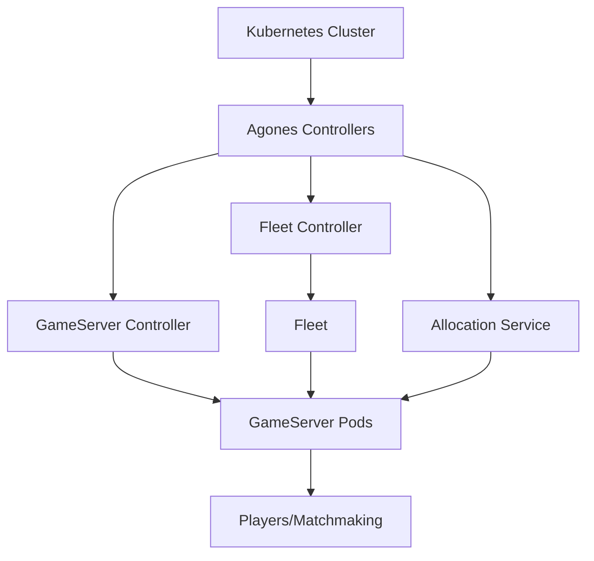
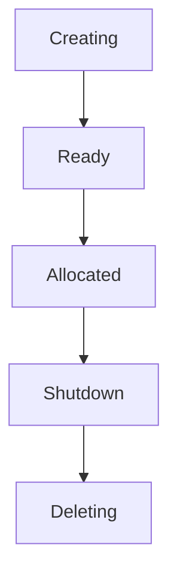
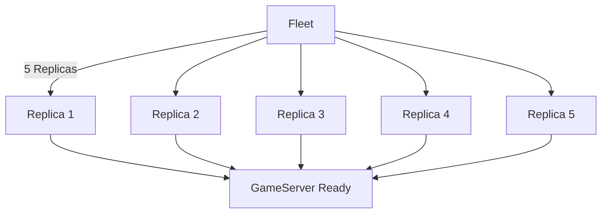
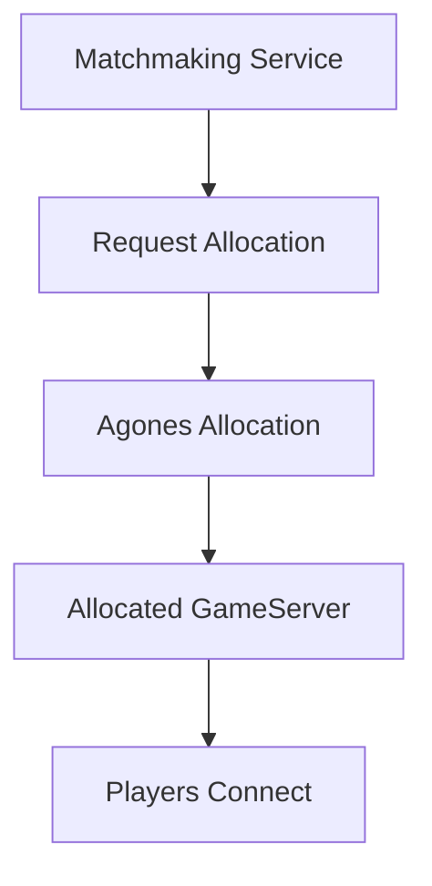
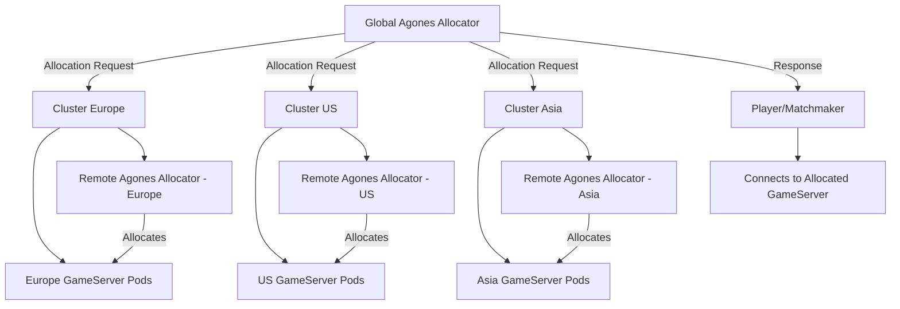

# Agones Overview

Agones is an open-source, Kubernetes-based platform for hosting, scaling, and managing multiplayer game servers. It automates game server creation, scaling, allocation, and management.

## Prerequisites

- **Kubernetes Cluster**: A working Kubernetes cluster with `kubectl` configured.
- **Agones Installed**: Follow the [Agones installation guide](https://agones.dev/site/docs/installation/install-agones/) to set up Agones on your Kubernetes cluster.

## Core Concepts

- **GameServer**: Represents a single instance of your game server.
- **Fleet**: A collection of identical game servers that scale dynamically based on demand.
- **Allocation**: Requests to allocate a game server for a player or matchmaker.
- **Scaling**: Adjusts the number of game servers in a fleet based on demand.

## 1. Agones Architecture Overview



- **GameServer Controller**: Manages the lifecycle of `GameServer` instances.
- **Fleet Controller**: Manages collections of game servers.
- **Allocation Service**: Allocates game servers for players.

## 2. GameServer Lifecycle



- **Creating**: GameServer pod is being created.
- **Ready**: Server is ready to accept players.
- **Allocated**: Server is allocated for a game session.
- **Shutdown/Deleting**: The server is shut down and removed.

## 3. Fleet Scaling



- **Fleet**: Manages multiple `GameServer` instances.
- **Scaling**: Adjusts the number of replicas based on demand.

## 4. GameServer Allocation Process



- **Request Allocation**: Matchmaking service requests a game server.
- **Agones Allocation**: Finds an available game server.
- **Allocated GameServer**: Players connect to the allocated server.

## 5. UDP Port Allocation in Agones

When deploying `GameServer` instances or creating a `Fleet`, Agones allows you to specify ports that the game server will use. Agones dynamically assigns port numbers based on the configuration defined in the manifest.

### How Port Allocation Works

- **Port Ranges**: Agones can allocate ports dynamically within a range using `portPolicy`.
- **Dynamic vs. Static Ports**: 
  - **Dynamic Ports**: Agones assigns available ports automatically within the specified range.
  - **Static Ports**: Allows for fixed port assignment.

### Example GameServer Manifest

```yaml
apiVersion: "agones.dev/v1"
kind: GameServer
metadata:
  name: example-gameserver
spec:
  ports:
    - name: game-port
      portPolicy: Dynamic
      containerPort: 7654
      protocol: UDP
      minPort: 7000
      maxPort: 8000
  container:
    image: gcr.io/agones-images/udp-server:0.21
```

## 9. Multi-Cluster Allocation in Agones

Multi-cluster allocation in Agones allows game servers to be allocated across multiple Kubernetes clusters, which is useful for ensuring high availability, geographic distribution, and efficient resource usage.

### Key Concepts

- **Global Agones Allocator**: A global service that handles allocation requests across different clusters.
- **Remote Allocators**: Each Kubernetes cluster runs its own Agones allocator service, which the global allocator communicates with.
- **Cross-Cluster Traffic Management**: Managed using networking solutions like Istio, enabling secure and efficient communication between clusters.
- **Failover and Redundancy**: If a game server cannot be allocated in one cluster, the global allocator can try other clusters, ensuring players are always connected to an available server.

### How Multi-Cluster Allocation Works

1. **Player/Matchmaker Request**: A player or matchmaker sends an allocation request to the global Agones allocator.
2. **Global Allocator Routing**: The global allocator uses labels, selectors, or other criteria to determine which cluster is best suited for the request.
3. **Remote Cluster Communication**: The global allocator communicates with the remote allocator in the selected Kubernetes cluster.
4. **Local Allocation**: The remote allocator in the chosen cluster finds an available game server and allocates it.
5. **Response to Player**: The global allocator returns the connection details of the allocated game server back to the player or matchmaker.

### Example Multi-Cluster Allocation Manifest

```yaml
apiVersion: "agones.dev/v1"
kind: GameServerAllocation
metadata:
  name: multi-cluster-allocation
spec:
  required:
    matchLabels:
      gameMode: battle-royale
  scheduling:
    strategy: MultiCluster
  clusters:
    - name: cluster-europe
      address: europe-allocator.example.com
    - name: cluster-us
      address: us-allocator.example.com
```

- **scheduling.strategy**: Specifies `MultiCluster` to enable multi-cluster allocation.
- **clusters**: Lists the clusters available for allocation, each with its name and the allocator service address.

### Multi-Cluster Allocation Architecture



- **Global Agones Allocator**: Routes allocation requests to the appropriate cluster.
- **Remote Agones Allocators**: Handle local game server allocation within their respective clusters.
- **GameServer Pods**: Represent game server instances that are managed locally by each cluster's allocator.

### Benefits of Multi-Cluster Allocation

- **Geographic Flexibility**: Allows players to connect to the nearest or best-performing cluster, reducing latency.
- **High Availability**: Ensures that if a cluster is down or full, other clusters can still serve player requests.
- **Resource Optimization**: Balances the load across multiple clusters, utilizing resources more efficiently.
