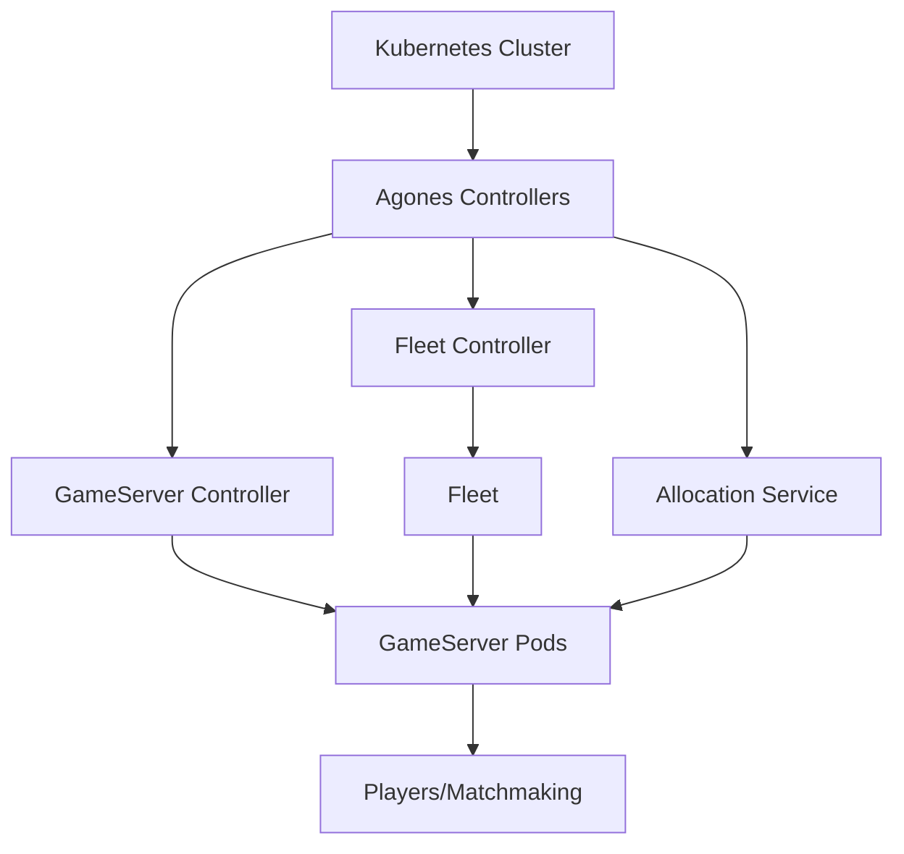
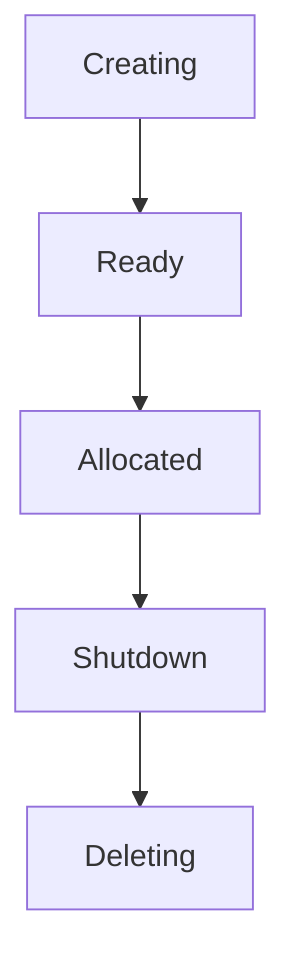
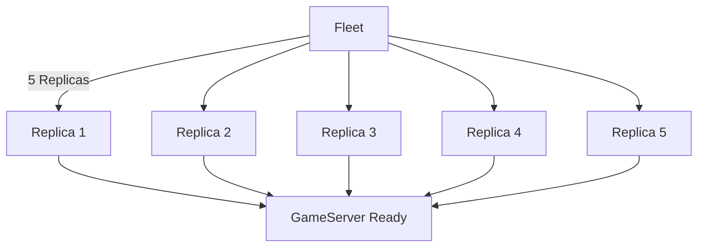
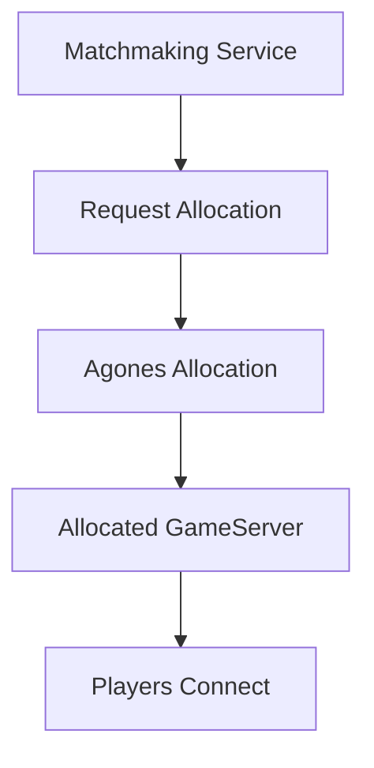
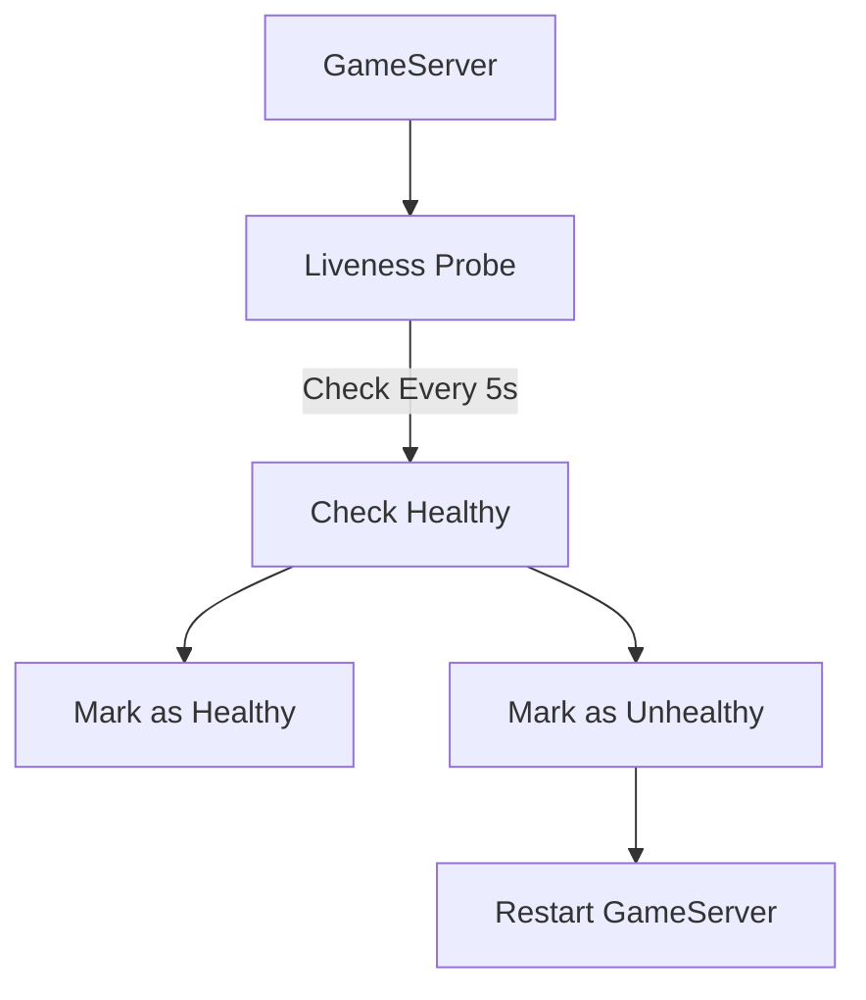
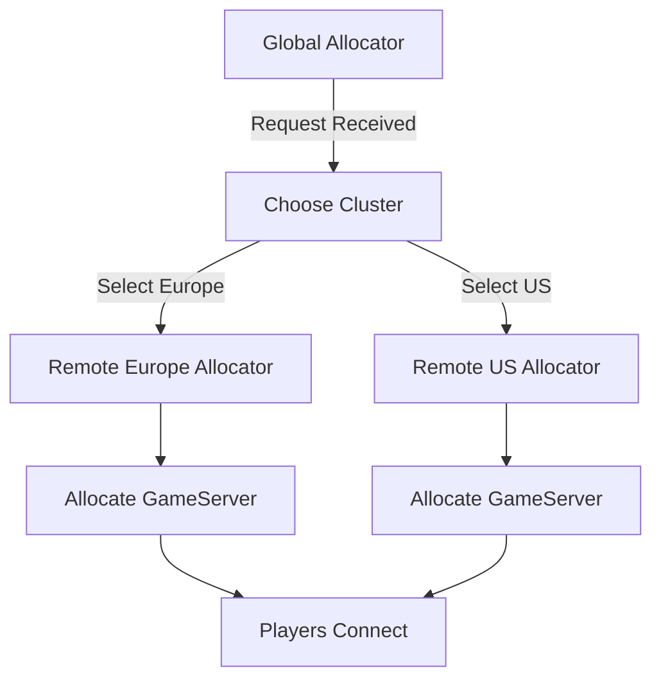
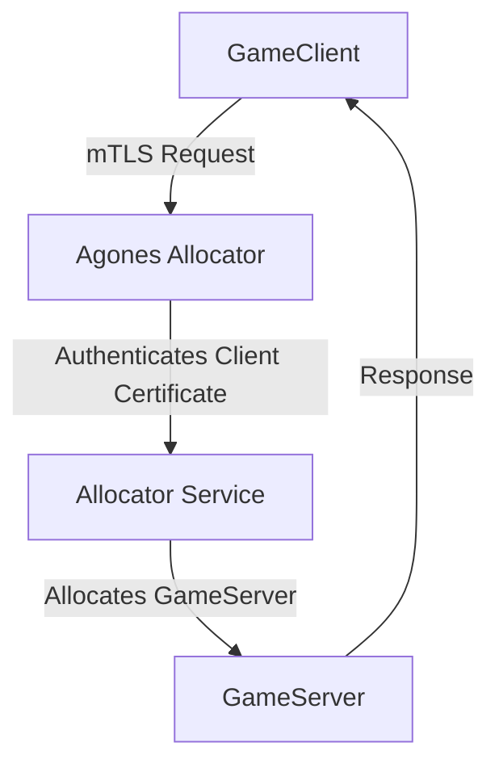
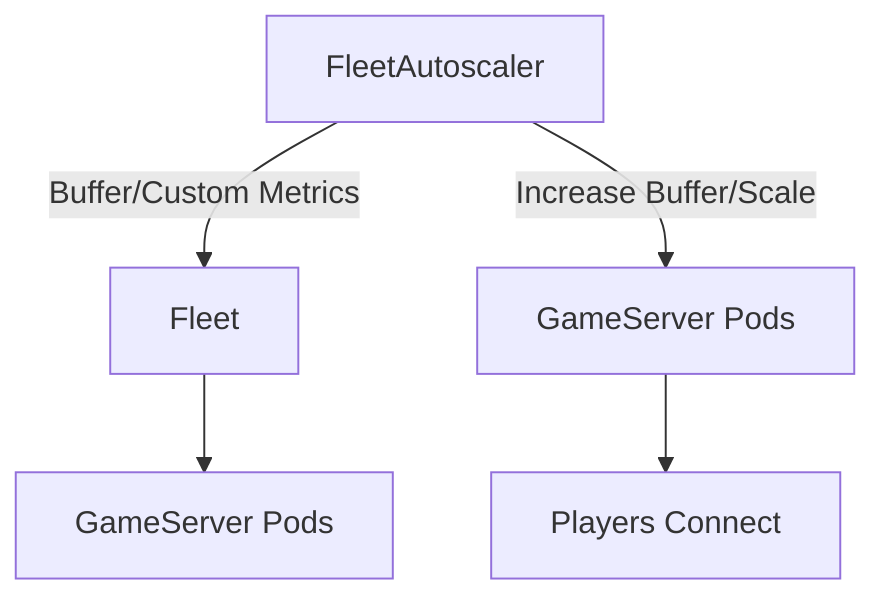

# Agones Overview

Agones is an open-source platform based on Kubernetes that hosts, scales, and manages multiplayer game servers. It automates the lifecycle of game servers, scaling, and allocation based on real-time demand.

## Prerequisites
- **Kubernetes Cluster**: A running Kubernetes cluster configured with `kubectl`.
- **Agones Installed**: Follow [Agones installation guide](https://agones.dev/site/docs/installation/install-agones/) to install Agones.

## Core Concepts
- **GameServer**: An instance of your game server.
- **Fleet**: A collection of game servers that scales dynamically based on demand.
- **Allocation**: Requests to allocate game servers for players.
- **Scaling**: Scales the game servers based on fleet demand.

---

## 1. Agones Architecture Overview

- **GameServer Controller**: Manages the lifecycle of GameServer instances.
- **Fleet Controller**: Manages fleets of game servers.
- **Allocation Service**: Allocates game servers based on demand.



Agones is built on top of Kubernetes and provides a platform for managing, scaling, and orchestrating multiplayer game servers. Agones leverages Kubernetes’ robust orchestration features to automate the lifecycle of game servers and ensure high availability and scalability. The architecture of Agones includes several key components that work together to manage game servers efficiently.

### 1. **Core Components of Agones**

Agones is composed of the following core components:

- **GameServer Controller**
- **Fleet Controller**
- **Allocation Service**
- **Autoscaling Controller**

These components are deployed as Kubernetes controllers and services, each handling specific aspects of game server management.

#### **GameServer Controller**

The **GameServer Controller** manages individual game server instances. It ensures that game servers go through their lifecycle phases, from creation to readiness, allocation, and termination. The GameServer Controller also monitors the health of game servers and automatically restarts them if they become unhealthy.

Key responsibilities:
- Handling the lifecycle of individual game servers.
- Ensuring that game servers are properly initialized and marked as ready.
- Managing the termination and cleanup of game servers.

#### **Fleet Controller**

The **Fleet Controller** manages groups of game servers called **Fleets**. Fleets allow game servers to be scaled dynamically based on player demand. The Fleet Controller ensures that enough game server instances are running to handle incoming requests, scaling the fleet up or down as necessary.

Key responsibilities:
- Managing the creation, scaling, and deletion of game servers within a fleet.
- Automatically scaling fleets based on demand, using FleetAutoscalers.
- Monitoring the overall health of the fleet and ensuring that it can meet player demand.

#### **Allocation Service**

The **Allocation Service** handles the process of allocating game servers to players. When a matchmaker or player requests a game server, the Allocation Service searches for an available server and assigns it to the request. Once allocated, the game server is reserved for the match, and no other players can connect to it.

Key responsibilities:
- Allocating game servers to players or matchmakers based on predefined rules and policies.
- Ensuring that allocated game servers are in a "Ready" state and can handle player connections.
- Marking game servers as "Allocated" to prevent conflicts or double assignments.

#### **Autoscaling Controller**

The **Autoscaling Controller** ensures that fleets of game servers can scale dynamically based on player demand or custom metrics. This controller works with the FleetAutoscaler resource to adjust the number of game servers running in a fleet, ensuring that enough servers are always available while minimizing resource usage.

Key responsibilities:
- Monitoring player demand and scaling game server fleets accordingly.
- Handling buffer-based scaling to ensure that there are always available game servers.
- Supporting custom metrics-based scaling for advanced resource optimization.

### 2. **Agones on Kubernetes**

Agones is designed to work natively with Kubernetes. Each game server instance is represented as a Kubernetes `Pod`, and the Agones controllers interact with these pods to manage their lifecycle. The architecture takes advantage of Kubernetes’ built-in features such as scheduling, autoscaling, and load balancing.

Agones extends Kubernetes with custom resources, including:

- **GameServer**: Represents an individual game server instance.
- **Fleet**: Represents a group of identical game servers.
- **GameServerAllocation**: Defines the process for allocating a game server to a player or matchmaker.
- **FleetAutoscaler**: Automatically scales a fleet of game servers based on player demand or metrics.

Agones also uses Kubernetes native resources such as `ConfigMaps`, `Secrets`, and `Services` to manage configurations, secrets, and network access for game servers.

### 3. **How the Components Interact**

Here’s how the key components of Agones interact with each other:

- **GameServer Creation**: When a new game server is needed, the GameServer Controller creates a new game server pod based on the `GameServer` resource.
  
- **Fleet Management**: The Fleet Controller ensures that the number of running game servers matches the desired fleet size, scaling up or down as needed. Fleets can be scaled automatically using FleetAutoscalers.
  
- **Allocation**: When a player or matchmaker requests a game server, the Allocation Service finds a suitable game server and allocates it. The game server is marked as "Allocated," and players can connect to it.

- **Autoscaling**: The Autoscaling Controller adjusts the size of the fleet based on player demand. If more players are connecting, the autoscaler will increase the number of game servers. If demand drops, the fleet size is reduced.

### 4. **Networking in Agones**

Networking in Agones is managed using Kubernetes services, which provide internal and external connectivity to game servers. Game servers can use both TCP and UDP protocols, depending on the game's networking requirements. Agones allows developers to configure dynamic or static port allocation for game servers, ensuring that each server has the necessary network access for player connections.

Agones also integrates with Kubernetes Ingress controllers and load balancers to manage external traffic to game servers.

### 5. **Security and Authentication**

Agones supports mTLS (mutual TLS) to secure communication between components. This is particularly important in multi-cluster setups, where allocators from different clusters need to communicate securely. Agones uses Kubernetes `Secrets` to store certificates and keys, ensuring that game servers and allocators authenticate each other securely before initiating communication.

---

### Agones Architecture Summary

- **GameServer Controller**: Manages the lifecycle of individual game servers.
- **Fleet Controller**: Manages scaling and health of fleets of game servers.
- **Allocation Service**: Handles the allocation of game servers to players or matchmakers.
- **Autoscaling Controller**: Ensures that fleets scale dynamically based on demand or custom metrics.
- **Networking**: Game servers are exposed using Kubernetes services, with support for both TCP and UDP protocols.
- **Security**: mTLS is used for secure communication between components, especially in multi-cluster environments.

---

## 2. GameServer Lifecycle
The GameServer lifecycle ensures servers are managed effectively, going through creation, readiness, allocation, and shutdown.



The **GameServer lifecycle** in Agones is a process that manages the creation, readiness, allocation, and termination of game server instances. This lifecycle ensures that game servers are appropriately handled and that players can be connected to healthy servers during gameplay. Agones uses Kubernetes resources and controllers to manage the lifecycle of each game server instance, automating the management and scaling process.

### 1. **GameServer Lifecycle Phases**

A `GameServer` instance goes through several distinct phases throughout its lifecycle:

- **Creating**: The game server is being created, and its container is being initialized.
- **Starting**: The game server container is running, but the server may still be in the process of initializing (e.g., loading assets or setting up network connections).
- **Ready**: The game server is fully initialized and is marked as "Ready" by Agones. In this state, the server can accept players, and it becomes available for allocation.
- **Allocated**: The game server has been assigned to a match or session, and it is now handling a specific game. In this state, no other players or matches can use this server until the current session ends.
- **Shutdown**: The game session has ended, and the server is shutting down. In this phase, the server is gracefully closed to avoid abrupt disconnections for players.
- **Terminated**: The game server instance is terminated, and its resources are freed. The server is removed from the pool of available game servers.

### 2. **GameServer Resource Example**

In Agones, the `GameServer` resource defines the configuration and behavior of each game server instance. Below is an example of a simple `GameServer` resource:

```yaml
apiVersion: "agones.dev/v1"
kind: GameServer
metadata:
  name: example-gameserver
spec:
  ports:
    - name: game-port
      containerPort: 7654
      protocol: UDP
  container:
    image: gcr.io/agones-images/udp-server:0.21
```

In this example:

- The `GameServer` is configured to run the `udp-server` image.
- It exposes a UDP port (7654) for player connections.
- The game server will go through its lifecycle phases as described above.

### 3. **GameServer Initialization and Readiness**

When a `GameServer` instance is first created, it goes through the **Creating** and **Starting** phases. During these phases, the game server initializes its environment and prepares to accept players. This may involve loading game assets, establishing network connections, or configuring server settings.

Once the server has completed its initialization, it transitions to the **Ready** state. Agones marks the server as "Ready" when it is fully operational and capable of handling players. In this state, the server is added to the pool of available servers and can be allocated for a match or session.

### 4. **GameServer Allocation**

The **Allocated** state is one of the most important phases in the game server lifecycle. When a player or matchmaker requests a game server, Agones allocates an available `GameServer` from the fleet. Once allocated, the server is reserved for that specific game session and cannot be used for any other matches until the session is complete.

The `GameServer` enters the **Allocated** phase when the allocation process is complete. In this phase, the server handles game logic, player connections, and other session-related tasks. Allocation ensures that the game server is exclusively used by the players in that session, preventing conflicts or interruptions from other players.

### 5. **Graceful Shutdown and Termination**

At the end of a game session, the `GameServer` enters the **Shutdown** phase. This phase ensures that the server gracefully shuts down, allowing any remaining player connections to be closed properly. This prevents players from being abruptly disconnected or losing game progress.

Once the shutdown process is complete, the `GameServer` is marked as **Terminated**. In this state, the server is removed from the pool of active game servers, and its resources (such as memory and CPU) are freed for other game servers to use.

### 6. **Handling GameServer State Transitions**

Agones provides several mechanisms for handling state transitions in the game server lifecycle:

- **Readiness Probes**: Kubernetes readiness probes are used to determine when a game server is ready to accept players. Agones uses these probes to move the server from the "Starting" to "Ready" phase.
  
- **Allocation Requests**: Allocation is triggered by an external request (usually from a matchmaker or player). Agones handles the allocation process and transitions the server to the "Allocated" phase when a request is received.

- **Health Checks**: Health checks (using liveness probes) monitor the health of the game server during its lifecycle. If a server becomes unhealthy, it can be restarted or marked as failed, ensuring that players are not connected to faulty servers.

### 7. **Fleet Management and Lifecycle Coordination**

In most Agones setups, game servers are managed as part of a fleet. The **Fleet** resource manages a group of game servers, scaling them up and down based on player demand. The lifecycle of each game server is coordinated by the fleet, which ensures that enough servers are always available to handle incoming player connections.

The fleet ensures that:

- New game servers are created when demand increases.
- Game servers are removed when demand decreases or when they are no longer needed.
- Each game server follows the full lifecycle process, from creation to termination, without interruptions.

---

### GameServer Lifecycle Summary

- **Creating**: The game server container is initialized.
- **Starting**: The game server is running but still initializing.
- **Ready**: The game server is fully initialized and available for player connections.
- **Allocated**: The game server has been assigned to a match and is handling the game session.
- **Shutdown**: The game server is gracefully shutting down after the game session ends.
- **Terminated**: The game server is terminated, and its resources are freed.

Agones automates the game server lifecycle, ensuring smooth transitions between states, graceful shutdowns, and efficient resource management for multiplayer games.

---

## 3. Fleet Scaling
Agones allows fleets to maintain multiple GameServer instances and adjusts them dynamically based on player demand.



In Agones, a **Fleet** is a collection of identical game server instances that scale up and down based on player demand or predefined rules. Fleet scaling is essential to efficiently managing server resources and ensuring that players always have access to a game server when they need one.

### 1. **What is a Fleet?**

A fleet is a set of `GameServer` instances that share the same configuration (e.g., game mode, region, or server type) and can be dynamically scaled to handle changes in player demand. Fleets can consist of many game servers running on different nodes within a Kubernetes cluster, allowing for seamless scaling and resource optimization.

**Example of a Fleet Resource**:

```yaml
apiVersion: "agones.dev/v1"
kind: Fleet
metadata:
  name: example-fleet
spec:
  replicas: 5
  template:
    spec:
      ports:
        - name: game-port
          containerPort: 7654
          protocol: UDP
      container:
        image: gcr.io/agones-images/udp-server:0.21
```

In this example, the fleet is configured with five game server replicas, each of which will run the specified container and expose a UDP port for player connections.

### 2. **Fleet Autoscaling**

Agones supports **FleetAutoscaler**, a resource that allows fleets to automatically scale up or down based on specific conditions. This is especially useful for handling fluctuating workloads, such as when there are peaks in player demand during certain hours or events.

Fleet autoscaling ensures that the right number of game servers is always available, while minimizing resource waste when demand decreases. The FleetAutoscaler adjusts the fleet size dynamically based on either a buffer of available game servers or custom metrics.

#### **Buffer-Based Scaling**

Buffer-based scaling maintains a buffer of ready game servers to ensure that new player requests can be handled immediately. This type of scaling ensures that a fleet always has a certain number of game servers in the "Ready" state.

**Example Buffer-Based Fleet Autoscaler**:

```yaml
apiVersion: "agones.dev/v1"
kind: FleetAutoscaler
metadata:
  name: buffer-autoscaler
spec:
  fleetName: example-fleet
  policy:
    type: Buffer
    buffer:
      bufferSize: 2        # Keep 2 extra GameServers always in "Ready" state
      minReplicas: 3       # Minimum of 3 replicas
      maxReplicas: 10      # Maximum of 10 replicas
```

In this example, the FleetAutoscaler ensures that there are always 2 extra `GameServer` instances ready for new player connections. The fleet can scale between 3 and 10 replicas, depending on demand.

#### **Custom Metrics-Based Scaling**

Custom metrics-based scaling allows fleets to scale based on custom-defined metrics, such as CPU usage, memory consumption, or the number of active players. This allows for fine-grained control over scaling behavior, making it ideal for resource optimization.

To implement custom metrics-based scaling, developers can use a webhook or integrate with an external metrics server.

**Example Custom Metrics-Based Fleet Autoscaler**:

```yaml
apiVersion: "agones.dev/v1"
kind: FleetAutoscaler
metadata:
  name: custom-metrics-autoscaler
spec:
  fleetName: example-fleet
  policy:
    type: Webhook
    webhook:
      service:
        name: custom-metrics-service
        namespace: default
        path: /scale
      timeoutSeconds: 30
    scale:
      minReplicas: 1
      maxReplicas: 50
```

In this example, the FleetAutoscaler is integrated with an external custom metrics service to determine when and how to scale the fleet. The fleet can scale between 1 and 50 replicas based on the custom metrics.

### 3. **Fleet Scaling Strategies**

Fleet scaling in Agones is designed to optimize both resource usage and player experience. Agones provides two main scaling strategies:

- **Horizontal Scaling**: Increases or decreases the number of game servers within a fleet based on predefined conditions, such as player demand or resource usage. This ensures that additional servers are added when demand spikes and removed when demand drops.
  
- **Vertical Scaling**: Instead of adjusting the number of game servers, vertical scaling adjusts the resources allocated to each game server (e.g., CPU, memory). This allows existing game servers to handle more load without adding new instances. Vertical scaling is more resource-efficient for certain workloads but is not the primary scaling mechanism in Agones.

### 4. **Scaling Based on Player Demand**

Scaling fleets based on player demand is one of the primary use cases for fleet scaling. The FleetAutoscaler can be configured to monitor metrics such as player count or game session requests and adjust the number of game server instances accordingly.

For example, during peak hours, the autoscaler may increase the number of game servers to ensure enough capacity for incoming players, while during off-peak hours, the number of servers can be reduced to save resources.

**Example of Player Demand-Based Scaling**:

```yaml
apiVersion: "agones.dev/v1"
kind: FleetAutoscaler
metadata:
  name: demand-based-autoscaler
spec:
  fleetName: example-fleet
  policy:
    type: Buffer
    buffer:
      bufferSize: 5        # Ensure 5 extra GameServers are available
      minReplicas: 5       # Minimum of 5 replicas during low demand
      maxReplicas: 20      # Maximum of 20 replicas during high demand
```

In this example, the fleet can scale between 5 and 20 replicas, depending on the player demand. The autoscaler ensures that there are always 5 extra game servers ready to handle new players.

### 5. **Monitoring Fleet Scaling**

Agones integrates with monitoring tools such as **Prometheus** and **Grafana** to provide insights into fleet scaling performance. Metrics such as the number of active game servers, scaling events, and resource usage can be tracked and visualized to ensure optimal scaling behavior.

- **Prometheus**: Fleet scaling metrics can be exported to Prometheus, where developers can monitor real-time data about game server replicas, scaling events, and resource utilization.
  
- **Grafana**: Using Grafana, developers can create custom dashboards to visualize fleet scaling trends, allowing them to adjust scaling policies or resource limits based on historical data.

---

### Fleet Scaling Summary

- **Fleet**: A collection of identical game servers that can be dynamically scaled up or down based on player demand.
- **Autoscaling**: Fleets can automatically scale using buffer-based or custom metrics-based policies to handle changing workloads.
- **Scaling Strategies**: Horizontal scaling adjusts the number of game servers, while vertical scaling adjusts resource allocations per server.
- **Demand-Based Scaling**: Fleets can scale based on player demand, ensuring sufficient capacity during peak hours and reducing resource waste during off-peak times.
- **Monitoring**: Fleet scaling metrics can be monitored using Prometheus and visualized using Grafana for insights into resource usage and scaling efficiency.
---

## 4. GameServer Allocation Process
This process ensures players are connected to an available and healthy GameServer.



The GameServer allocation process in Agones is essential for ensuring that players are connected to the appropriate game server when they are ready to join a match. Agones uses an allocation mechanism that assigns game servers from a fleet or directly from individual game server instances based on predefined rules and player requests. 

### 1. **What is GameServer Allocation?**

GameServer allocation refers to the process of selecting and assigning an available game server to handle a new game session or player connection. In multiplayer games, allocation is critical to ensuring that players are connected to healthy and available servers that can handle their game session. This process must be efficient to provide a seamless gaming experience for players.

Agones handles allocation by selecting `GameServer` instances that meet specific requirements, such as being in a "Ready" state, matching certain labels, and adhering to allocation policies.

### 2. **The Allocation Lifecycle**

The typical lifecycle of GameServer allocation includes the following steps:

- **Request**: A matchmaker or game client sends an allocation request to Agones. This request usually specifies certain criteria (e.g., game mode, region) that the allocated game server must meet.
  
- **Selection**: Agones searches for available game servers in the fleet or individually based on the criteria specified in the request. Only game servers that are marked as "Ready" (and have passed health checks) are considered.

- **Allocation**: Once a suitable game server is found, Agones marks it as "Allocated," meaning that it is reserved for the match or player connection. The allocated server will not be used by any other game session until it is released (after the match or session ends).

- **Response**: Agones returns the connection information (e.g., IP address and port) for the allocated game server to the matchmaker or player client, allowing players to connect to the game.

- **Release**: After the game session is complete, the game server is either shut down (if it is no longer needed) or returned to the pool of available servers.

### 3. **GameServerAllocation Resource**

In Agones, the allocation process is handled using a Kubernetes custom resource called `GameServerAllocation`. This resource defines the parameters and criteria for allocating a game server.

**Example GameServerAllocation Resource**:

```yaml
apiVersion: "agones.dev/v1"
kind: GameServerAllocation
metadata:
  name: game-allocation
spec:
  required:
    matchLabels:
      gameMode: battle-royale
  scheduling: Packed
  metadata:
    labels:
      role: leader
```

In this example:

- **matchLabels**: Specifies that only game servers labeled with `gameMode: battle-royale` should be considered for allocation.
- **scheduling**: Determines how game servers are scheduled. `Packed` scheduling attempts to fill up existing servers before creating new ones.
- **labels**: Additional labels can be added to the game server metadata upon allocation. In this case, the game server is labeled as a "leader."

### 4. **Scheduling Strategies**

Agones provides two primary scheduling strategies for allocating game servers:

- **Packed Scheduling**: In packed scheduling, Agones attempts to fill up game servers that are already in use before allocating new ones. This strategy is useful when you want to maximize resource utilization by minimizing the number of game server instances running at the same time.

- **Distributed Scheduling**: In distributed scheduling, Agones attempts to spread game sessions across as many game servers as possible. This strategy is useful when you want to minimize the impact of a single game server failure on active game sessions.

**Example of Scheduling Strategies**:

```yaml
apiVersion: "agones.dev/v1"
kind: GameServerAllocation
metadata:
  name: distributed-allocation
spec:
  scheduling: Distributed
  required:
    matchLabels:
      gameMode: capture-the-flag
```

In this example, game servers are allocated using the `Distributed` strategy, and only servers with the `capture-the-flag` game mode are considered.

### 5. **Allocation Policies**

Agones allows developers to specify policies that control how game servers are allocated. These policies ensure that game servers are allocated efficiently and in line with the needs of the game.

- **Selectors**: The allocation request can include selectors that filter which game servers can be allocated based on labels, annotations, or game server properties (e.g., game mode, region, version).

- **Priorities**: Game servers can be prioritized based on specific criteria. For example, you might prioritize allocating game servers that are in a certain geographical region to reduce player latency.

**Example GameServerAllocation with Selector**:

```yaml
apiVersion: "agones.dev/v1"
kind: GameServerAllocation
metadata:
  name: high-priority-allocation
spec:
  required:
    matchLabels:
      region: europe
  preferred:
    - matchLabels:
        version: v1.2
  scheduling: Packed
```

In this example, game servers in the "europe" region are required, and game servers running version `v1.2` are preferred, with packed scheduling used to maximize resource utilization.

### 6. **Handling Failed Allocations**

In cases where no suitable game server is found (i.e., no servers are available or meet the allocation criteria), the allocation request fails. Agones allows developers to define fallback mechanisms, such as:

- **Reallocating to a Different Region**: If no game servers are available in the preferred region, the allocation request can be re-routed to another region.
- **Wait for Server Availability**: The allocation request can wait for a certain period for a game server to become available before timing out.

### 7. **Monitoring Allocations**

Agones provides tools for monitoring the allocation process, allowing developers to track allocation success rates, latencies, and resource utilization across fleets. This is critical for optimizing performance, especially in large-scale multiplayer environments.

- **Prometheus Metrics**: Allocation metrics such as request counts, failures, and response times can be exported to Prometheus for real-time monitoring and visualization.
  
- **Grafana Dashboards**: Developers can create custom dashboards to track the allocation process, helping to identify bottlenecks or resource shortages in the fleet.

---

### GameServer Allocation Process Summary

- **Allocation Requests**: Matchmakers or clients send requests to Agones to allocate available game servers.
- **Scheduling**: Game servers can be allocated using packed or distributed scheduling strategies, depending on the desired resource utilization.
- **Allocation Policies**: Developers can specify policies, labels, and selectors to control how game servers are allocated.
- **Monitoring**: Allocation metrics can be monitored using tools like Prometheus and Grafana for better visibility into resource usage and allocation efficiency.
---

## 5. UDP Port Allocation in Agones
Agones allows the allocation of UDP ports dynamically or statically based on the `GameServer` manifest.

Agones allows dynamic or static allocation of UDP ports for game servers. This flexibility in port allocation is crucial for multiplayer games, which often use UDP for fast and efficient communication between game clients and servers. Agones enables developers to define port policies, ranges, and configurations tailored to the needs of their game servers.

### 1. **Port Allocation Methods**

Agones supports two main methods for allocating UDP ports:

- **Dynamic Ports**: Agones automatically assigns an available port from a specified range. This method is commonly used when you want Agones to manage port assignment, making it suitable for dynamic and scalable environments where you don't need to control specific port numbers.

- **Static Ports**: Developers can specify a fixed port that the game server should always use. Static port allocation is useful when the game server must always bind to the same port, or when integrating with external services that require fixed port numbers.

### 2. **Dynamic UDP Port Allocation**

With dynamic port allocation, Agones assigns available ports to game servers from a specified range. This is particularly useful when running multiple instances of game servers, each requiring its own port for client connections. Dynamic allocation ensures that the ports do not conflict, and Agones manages the assignment and availability of the ports.

- **Dynamic Port Configuration**: When using dynamic allocation, the developer specifies a range of ports that Agones can choose from. The game server binds to the dynamically assigned port at runtime.

**Example Dynamic UDP Port Allocation**:

```yaml
apiVersion: "agones.dev/v1"
kind: GameServer
metadata:
  name: example-gameserver
spec:
  ports:
    - name: game-port
      portPolicy: Dynamic
      containerPort: 7654
      protocol: UDP
      minPort: 7000
      maxPort: 8000
  container:
    image: gcr.io/agones-images/udp-server:0.21
```

- **minPort** and **maxPort**: Defines the range of ports (7000-8000 in this example) that Agones can dynamically allocate from.
- **containerPort**: Defines the port within the container that the game server application will listen on. Agones will map this container port to a dynamically assigned host port.

### 3. **Static UDP Port Allocation**

Static port allocation allows developers to specify a fixed port for the game server. This is useful in scenarios where you need predictable port numbers, such as when integrating with firewalls, load balancers, or specific network configurations.

**Example Static UDP Port Allocation**:

```yaml
apiVersion: "agones.dev/v1"
kind: GameServer
metadata:
  name: example-static-gameserver
spec:
  ports:
    - name: game-port
      portPolicy: Static
      containerPort: 7654
      hostPort: 7654
      protocol: UDP
  container:
    image: gcr.io/agones-images/udp-server:0.21
```

- **portPolicy: Static**: Indicates that a fixed port should be used.
- **hostPort**: Specifies the exact port (7654 in this case) that will be used on the host machine. The game server will always bind to this port.

### 4. **Port Policies**

Agones uses a `portPolicy` field to determine how ports are allocated for game servers. This field can be set to:

- **Dynamic**: Agones will dynamically allocate a port from a specified range.
- **Static**: Agones will use a fixed, predefined port.

- **Passthrough**: The game server defines the ports it uses, and Agones does not manage the ports. This policy is useful for legacy game servers that already manage their own port assignment and cannot be modified to use dynamic or static allocation.

**Example of Passthrough Port Policy**:

```yaml
apiVersion: "agones.dev/v1"
kind: GameServer
metadata:
  name: example-passthrough-gameserver
spec:
  ports:
    - name: game-port
      portPolicy: Passthrough
      containerPort: 7654
      protocol: UDP
  container:
    image: gcr.io/agones-images/udp-server:0.21
```

### 5. **Choosing Between Dynamic and Static Ports**

When deciding between dynamic and static port allocation, consider the following factors:

- **Dynamic Port Allocation**: 
  - Ideal for highly scalable environments where you have multiple game server instances.
  - Ports are automatically assigned, reducing the risk of conflicts.
  - Suitable for Kubernetes environments where service discovery and network management are handled dynamically.

- **Static Port Allocation**:
  - Best for predictable environments where specific port numbers are required (e.g., for firewall rules or integration with third-party services).
  - Useful for legacy systems that expect specific port configurations.

### 6. **Port Allocation in Fleets**

When creating fleets of game servers in Agones, the port allocation strategy also applies to the entire fleet. Whether dynamic or static ports are used, Agones ensures that each `GameServer` instance in the fleet has a unique port for client connections.

**Example Fleet Port Allocation**:

```yaml
apiVersion: "agones.dev/v1"
kind: Fleet
metadata:
  name: example-fleet
spec:
  replicas: 5
  template:
    spec:
      ports:
        - name: game-port
          portPolicy: Dynamic
          containerPort: 7654
          protocol: UDP
          minPort: 7000
          maxPort: 8000
      container:
        image: gcr.io/agones-images/udp-server:0.21
```

In this example, the fleet consists of 5 game server replicas, each with its own dynamically allocated port from the range of 7000-8000. Agones ensures that no two game servers in the fleet use the same host port, allowing for efficient scaling.

### 7. **Security Considerations for Port Allocation**

When allocating UDP ports, especially in a dynamic environment, it's important to consider security implications:

- **Firewall Rules**: Ensure that the range of dynamic ports you specify is allowed in your firewall rules, particularly if the game servers need to communicate with external clients.
  
- **Network Policies**: In Kubernetes, network policies can be used to control which pods and services can communicate with each other over specific ports. When using dynamic ports, ensure that your network policies are flexible enough to allow for the dynamically assigned ports.

- **Monitoring**: Monitor the port usage across your game server fleet to ensure that ports are being efficiently allocated and are not experiencing conflicts or bottlenecks.

---

### UDP Port Allocation Summary

- **Dynamic Ports**: Agones automatically assigns ports from a specified range, ideal for scalable environments.
- **Static Ports**: Developers can specify a fixed port for predictable networking configurations.
- **Port Policies**: The `portPolicy` field controls whether ports are dynamically assigned, statically assigned, or passthrough.
- **Fleets**: Agones can manage port allocation across fleets of game servers, ensuring unique port assignments for each instance.
- **Security**: Ensure that firewall rules and network policies are configured correctly when using dynamic port allocation.

---

## 6. Agones SDK

The Agones SDK allows game servers to interact with Agones and manage their lifecycle, such as being marked as "Ready", "Allocated", or "Shutdown".

The **Agones SDK** is a crucial component that enables communication between game servers and the Agones platform. It allows game servers to notify Agones about their status, handle lifecycle events, and report health information. By integrating the Agones SDK into game server code, developers can ensure that their servers properly register with the Agones system, mark themselves as ready, handle allocation, and gracefully shut down when needed.

### 1. **Core SDK Functions**

The Agones SDK provides several key functions that are used by game servers to interact with Agones:

- **Ready()**: This function marks the game server as "Ready" to accept player connections. After a game server is created, it may need to go through an initialization process before being available for players. Once the server is ready, it should call this function to signal its readiness to Agones.

- **Allocate()**: Marks the game server as "Allocated" when it has been assigned to a match. This happens after Agones allocates the server for a specific player or match request.

- **Health()**: The game server can periodically send health updates to Agones using this function. This allows the game server to indicate that it is functioning correctly, preventing it from being marked as unhealthy by Agones.

- **Shutdown()**: Gracefully shuts down the game server when it has completed its session or is no longer needed. This function signals to Agones that the server can be safely removed from the pool of available servers.

- **WatchGameServer()**: This function sets up a watch on the `GameServer` resource, allowing the game server to receive updates about its state (e.g., when it's allocated or marked for shutdown). The server can use these updates to adjust its behavior based on lifecycle events.

### 2. **Integrating the SDK**

To integrate the Agones SDK, you need to import the SDK into your game server code and register the server with Agones. The following example shows how to use the SDK in a simple Go-based game server.

**Example SDK Integration (Go)**:

```go
package main

import (
    "log"
    "time"
    "agones.dev/agones-sdk-go/pkg/sdk"
)

func main() {
    // Create a new Agones SDK instance
    sdk, err := sdk.NewSDK()
    if err != nil {
        log.Fatalf("Could not create SDK instance: %v", err)
    }

    // Mark the server as ready to accept players
    err = sdk.Ready()
    if err != nil {
        log.Fatalf("Could not send Ready request: %v", err)
    }

    // Periodically send health updates
    go func() {
        for {
            err := sdk.Health()
            if err != nil {
                log.Fatalf("Could not send health check: %v", err)
            }
            time.Sleep(2 * time.Second)  // Send health check every 2 seconds
        }
    }()

    // Simulate game server running for 30 minutes
    time.Sleep(30 * time.Minute)

    // Shut down the game server gracefully
    err = sdk.Shutdown()
    if err != nil {
        log.Fatalf("Could not send Shutdown request: %v", err)
    }
}
```

### 3. **Handling GameServer Lifecycle**

The Agones SDK helps manage the entire lifecycle of the game server, from creation to shutdown:

- **Creation**: When a new game server instance is created, it may need time to initialize. During this time, it should not be marked as ready. Once it is fully initialized, the server calls `Ready()` to signal its readiness to Agones.

- **Allocation**: When a matchmaker or player requests a game server, Agones allocates the server and changes its status to "Allocated." The game server can use the `WatchGameServer()` function to watch for this allocation event and start preparing for player connections.

- **Shutdown**: Once the game session is complete, the game server can call `Shutdown()` to gracefully exit. This ensures that Agones stops allocating the server to new players and properly cleans up the server resources.

### 4. **GameServer State Watching**

Using the `WatchGameServer()` function, game servers can monitor the state of their `GameServer` resource. This is useful for reacting to events such as allocation or shutdown in real-time.

**Example of Watching GameServer State**:

```go
package main

import (
    "log"
    "agones.dev/agones-sdk-go/pkg/sdk"
)

func main() {
    sdk, err := sdk.NewSDK()
    if err != nil {
        log.Fatalf("Could not create SDK instance: %v", err)
    }

    // Watch for GameServer state changes
    err = sdk.WatchGameServer(func(gs *sdk.GameServer) {
        log.Printf("GameServer state changed: %v", gs.Status.State)
    })
    if err != nil {
        log.Fatalf("Could not watch GameServer state: %v", err)
    }

    // Run game server logic...
}
```

### 5. **Health Checks with SDK**

The Agones SDK allows game servers to report their health status periodically. This is especially useful for long-running game sessions where the server needs to remain healthy to continue serving players. If the game server becomes unhealthy and stops sending health updates, Agones will mark it as unhealthy and take appropriate actions (e.g., restart the server or remove it from the pool).

- **Health Reporting**: The `Health()` function sends a health signal to Agones. If this signal is not sent within a certain period, the server may be considered unhealthy.

**Example Health Check**:

```go
go func() {
    for {
        err := sdk.Health()
        if err != nil {
            log.Fatalf("Could not send health check: %v", err)
        }
        time.Sleep(5 * time.Second) // Send health check every 5 seconds
    }
}()
```

### 6. **SDK Support for Different Languages**

The Agones SDK is available in multiple languages, allowing developers to integrate it into their game servers regardless of the programming language being used. Official SDKs are provided for:

- **Go**
- **C++**
- **Java**
- **Node.js**

Developers can choose the appropriate SDK for their game server's programming language and follow similar patterns for integrating Agones features such as `Ready()`, `Health()`, and `Shutdown()`.

### 7. **Custom SDK Extensions**

In addition to the official SDKs, developers can create custom SDK extensions to add specific functionality or support additional use cases. For example, you might want to create a custom SDK for a language that is not officially supported or extend the SDK with additional lifecycle management features specific to your game server architecture.

---

### Agones SDK Summary

- **Ready()**: Signals that the game server is ready to accept players.
- **Allocate()**: Marks the game server as allocated for a match or player.
- **Health()**: Periodically reports the health of the game server to Agones.
- **Shutdown()**: Gracefully shuts down the game server after a session is complete.
- **WatchGameServer()**: Watches for changes to the game server's state, such as allocation or shutdown.
- **Multilingual Support**: SDKs are available for multiple languages, including Go, Java, C++, and Node.js, allowing developers to choose the best fit for their game servers.
---

## 7. Health Checks
Agones uses Kubernetes’ liveness probe to ensure that only healthy game servers are allocated to players.



Health checks in Agones are critical to ensuring that only healthy game servers are available for players. Agones relies on Kubernetes' native health check mechanisms, such as liveness and readiness probes, to monitor the health of `GameServer` instances. These checks allow Agones to detect issues with game servers, automatically restart unhealthy servers, and prevent player connections to servers that are not ready.

### 1. **Liveness Probe**

The **liveness probe** checks whether a game server is running and healthy. If the liveness probe fails, Kubernetes will restart the game server, ensuring that any unresponsive or crashed game servers are automatically recovered.

- **Function**: Ensures the game server is healthy and capable of functioning. If a server becomes unresponsive or enters an unhealthy state, the liveness probe triggers a restart.
- **Configuration**: The liveness probe can be configured to send periodic requests to the game server to verify its health.

**Example Liveness Probe Configuration**:

```yaml
apiVersion: "agones.dev/v1"
kind: GameServer
metadata:
  name: example-gameserver
spec:
  container:
    image: gcr.io/agones-images/udp-server:0.21
    livenessProbe:
      httpGet:
        path: /healthz
        port: 8080
      initialDelaySeconds: 30
      periodSeconds: 5
```

- **Initial Delay**: The probe waits for a specified period (30 seconds in this example) before checking the server's health.
- **Period Seconds**: The probe checks the server's health every 5 seconds.

### 2. **Readiness Probe**

The **readiness probe** determines when a game server is ready to accept player connections. A server might not be immediately ready after starting up, and the readiness probe ensures that only servers that have successfully completed initialization can be allocated to players.

- **Function**: Prevents players from being connected to a game server that is still initializing or not yet ready to handle game sessions.
- **Configuration**: Similar to the liveness probe, the readiness probe can be configured to check the server's readiness by sending requests to a specific endpoint.

**Example Readiness Probe Configuration**:

```yaml
apiVersion: "agones.dev/v1"
kind: GameServer
metadata:
  name: example-gameserver
spec:
  container:
    image: gcr.io/agones-images/udp-server:0.21
    readinessProbe:
      httpGet:
        path: /ready
        port: 8080
      initialDelaySeconds: 5
      periodSeconds: 3
```

- **Initial Delay**: The readiness probe starts checking after 5 seconds.
- **Period Seconds**: It checks the readiness every 3 seconds.

### 3. **Custom Health Checks**

Agones also allows developers to implement **custom health checks** tailored to the specific needs of their game server. Custom health checks can be added in the server code, which can periodically report its health status back to the Agones controller. If a custom health check fails, Agones can mark the server as unhealthy and either restart it or prevent new player allocations.

- **Use Case**: In some cases, the built-in liveness and readiness probes may not fully capture the complexity of a game's health requirements. For example, you might want to monitor specific in-game conditions, like the number of active connections or memory usage, and report the health status based on that.

**Example Custom Health Check (Using Agones SDK)**:

```go
package main

import (
    "log"
    "time"
    "agones.dev/agones-sdk-go/pkg/sdk"
)

func main() {
    sdk, err := sdk.NewSDK()
    if err != nil {
        log.Fatalf("Could not connect to SDK: %v", err)
    }

    // Periodically send a health check status
    go func() {
        for {
            err := sdk.Health()
            if err != nil {
                log.Fatalf("Could not send health check: %v", err)
            }
            time.Sleep(2 * time.Second) // Custom health check interval
        }
    }()

    // Simulate a running game server
    time.Sleep(30 * time.Minute)
}
```

### 4. **Health Check Failure and Recovery**

When a health check fails, Agones takes specific actions to recover the game server:

- **Liveness Probe Failure**: If the liveness probe fails, Kubernetes restarts the game server container. This ensures that unresponsive servers are automatically restarted.
- **Readiness Probe Failure**: If the readiness probe fails, the game server is marked as "Not Ready," and Agones will not allocate players to that server until it becomes healthy again.

This mechanism ensures that only healthy game servers can accept player connections, improving the overall gaming experience.

### 5. **Graceful Shutdown and Health Checks**

When a game server is shutting down, Agones ensures that it completes existing game sessions before marking the server as unhealthy. This prevents players from being abruptly disconnected during a graceful shutdown. The server’s health checks are used to mark the server as "Allocated" or "Shutdown" based on its state.

- **Graceful Shutdown**: Agones allows a server to finish its current session before shutting down. During this period, the server might fail readiness checks, ensuring that no new players are connected, while the liveness checks ensure that the server remains operational until all active sessions are complete.

### 6. **Monitoring Health Check Metrics**

Agones integrates well with popular monitoring tools like **Prometheus** and **Grafana**. You can track health check metrics, such as the number of healthy servers, the frequency of health check failures, and the time taken for recovery.

- **Prometheus Metrics**: Health check metrics can be exported to Prometheus, which allows you to visualize the overall health of your game servers. These metrics help you monitor trends, identify recurring issues, and optimize health check configurations.
  
- **Grafana Dashboards**: Visualize health check data and server health trends over time using Grafana dashboards, allowing for real-time insights into your game server health.

---

### Health Checks Summary

- **Liveness Probe**: Ensures that the game server is healthy and functional. If it fails, Kubernetes will automatically restart the server.
- **Readiness Probe**: Determines when a game server is ready to accept players, ensuring that players are only connected to servers that are fully initialized.
- **Custom Health Checks**: Developers can implement custom health checks to monitor specific in-game conditions or server metrics.
- **Failure Handling**: Agones ensures automatic recovery by restarting unhealthy servers or marking them as "Not Ready" to prevent player connections.
- **Monitoring**: Health check metrics can be monitored using Prometheus and visualized using Grafana for better observability and issue detection.

---

## 8. Multi-Cluster Allocation
Agones supports allocating game servers across multiple clusters to ensure high availability and geographic distribution of resources.



Multi-cluster allocation in Agones allows the allocation of game servers across multiple Kubernetes clusters, enabling high availability, regional proximity, and efficient resource utilization. This feature is essential for game developers looking to scale globally or optimize resource usage by distributing workloads across multiple clusters.

### 1. **Why Use Multi-Cluster Allocation?**

- **High Availability**: By distributing game server instances across multiple clusters, Agones ensures that if one cluster experiences an outage or becomes overloaded, other clusters can still handle incoming requests.
  
- **Geographical Distribution**: Multi-cluster allocation ensures that players can connect to game servers closest to their geographical location, minimizing latency and providing a better gaming experience.
  
- **Resource Optimization**: Allocating game servers across clusters helps to balance the load and optimize resource usage. You can make better use of Kubernetes resources by distributing workloads based on cluster availability and capacity.

### 2. **How Multi-Cluster Allocation Works**

Multi-cluster allocation in Agones relies on the **Global Agones Allocator** and **Remote Allocators**.

- **Global Agones Allocator**: This service acts as the central point for receiving allocation requests from players or matchmaking services. It routes these requests to one or more remote allocators based on predefined allocation strategies (e.g., proximity, availability, load balancing).

- **Remote Allocators**: Each Kubernetes cluster that hosts Agones runs its own allocator service. The global allocator communicates with these remote allocators to find the best cluster for allocating a game server.

### 3. **Key Components of Multi-Cluster Allocation**

- **Global Allocator**: Receives and processes allocation requests, determines the best cluster for the allocation based on labels, selectors, or policies, and forwards the request to the corresponding remote allocator.

- **Remote Allocators**: Remote allocators are located in each Kubernetes cluster. These allocators manage local fleet resources and respond to the global allocator with available game servers.

- **Clusters**: Each cluster runs its own Agones setup, and the global allocator communicates with these clusters to allocate game servers in different regions or environments.

### 4. **Multi-Cluster Allocation Strategies**

- **Geographical Proximity**: The allocator selects clusters based on proximity to the player, ensuring minimal latency by routing players to the nearest available game server.

- **Load Balancing**: The allocator uses load-balancing strategies to ensure that no single cluster becomes overloaded. It can spread game server allocations across clusters to distribute traffic evenly.

- **Failover**: If one cluster is unavailable, the allocator will route the allocation request to another cluster to ensure that players can still connect to a game server. This is crucial for maintaining high availability.

### 5. **Example Multi-Cluster Allocation Manifest**

Below is an example of a multi-cluster allocation manifest in Agones:

```yaml
apiVersion: "agones.dev/v1"
kind: GameServerAllocation
metadata:
  name: multi-cluster-allocation
spec:
  required:
    matchLabels:
      gameMode: battle-royale
  scheduling:
    strategy: MultiCluster
  clusters:
    - name: cluster-europe
      address: europe-allocator.example.com
    - name: cluster-us
      address: us-allocator.example.com
```

In this manifest:

- **GameServerAllocation**: Defines the request to allocate a game server.
- **Match Labels**: Specifies labels like `gameMode` to filter the type of game server required.
- **Scheduling Strategy**: Defines the strategy as `MultiCluster`, indicating the allocator will distribute the allocation request across multiple clusters.
- **Clusters**: Specifies a list of clusters (e.g., Europe and US regions) that can handle the allocation request.

### 6. **Setting Up Multi-Cluster Allocation**

1. **Install Agones in Each Cluster**: Agones needs to be installed and configured in each Kubernetes cluster that will participate in the multi-cluster setup.

2. **Configure Remote Allocators**: Each Kubernetes cluster must have its own Agones allocator, which will respond to allocation requests from the global allocator.

3. **Global Allocator Configuration**: The global allocator needs to be set up to communicate with the remote allocators in each cluster. This can be done by defining the cluster addresses in the global allocator configuration.

4. **mTLS Setup**: For secure communication between clusters, configure mTLS (mutual TLS) to authenticate communication between global and remote allocators. This prevents unauthorized access and ensures data integrity.

5. **Cluster-Specific Policies**: You can set up policies or labels for each cluster to determine which types of game servers should be allocated from each region (e.g., different game modes or player limits for different clusters).

### 7. **Scaling Multi-Cluster Environments**

Agones supports autoscaling in a multi-cluster environment. Each cluster can scale its fleets independently based on local player demand. In addition, the global allocator can route requests to clusters with available resources, optimizing the overall scaling strategy.

- **Cluster-Aware Autoscaling**: Each cluster runs its own FleetAutoscaler to manage local fleet scaling. For example, the Europe cluster might scale up based on player traffic, while the US cluster might scale down due to lower demand.

- **Cross-Cluster Scaling**: When one cluster reaches its resource limits, the global allocator can shift game server requests to a different cluster that has available capacity.

### 8. **Monitoring and Observability**

- **Metrics**: Agones provides monitoring for both global and remote allocators. You can use tools like Prometheus and Grafana to track metrics such as the number of allocated game servers, request latencies, and resource utilization across clusters.
  
- **Logging**: Multi-cluster setups generate logs from both global and remote allocators. It's important to centralize these logs for easier monitoring and troubleshooting. Tools like Elasticsearch or Fluentd can aggregate logs from multiple clusters.

### 9. **Challenges in Multi-Cluster Allocation**

- **Networking and Latency**: Ensuring that communication between clusters is fast and reliable can be challenging, especially when clusters are geographically distant. Using services like Istio or other networking solutions can help manage cross-cluster traffic.
  
- **Complexity**: Managing multiple clusters introduces operational complexity. It requires careful planning and configuration to ensure that clusters are properly integrated and can handle allocation requests efficiently.

- **Security**: Securing communication between clusters with mTLS and other network security measures is critical in multi-cluster environments to prevent unauthorized access.

---

### Multi-Cluster Allocation Summary

- **High Availability**: Distributes game servers across clusters to ensure availability, even in case of cluster outages.
- **Geographical Proximity**: Routes players to the nearest available cluster to minimize latency.
- **Efficient Resource Use**: Balances load across clusters, optimizing resource usage.
- **Scaling**: Supports autoscaling within and across clusters based on player demand and resource availability.
- **Security**: Requires secure, authenticated communication between clusters using mTLS.
---

## 9. mTLS in Agones Allocation
Agones supports mTLS (mutual TLS) to secure communication between game clients and the Agones allocator, ensuring that only authenticated services interact with one another.


Mutual TLS (mTLS) is a crucial security feature that ensures both the client and the server authenticate each other before initiating communication. In the context of Agones, mTLS ensures secure communication between game clients, Agones allocators, and game servers.

### 1. **Why Agones Needs mTLS**

- **Secure Communication**: Multiplayer games often involve sensitive data, such as player identities, game state information, and transactions. Agones uses mTLS to ensure that communication between game clients and the Agones platform is encrypted and secure. This prevents man-in-the-middle attacks and unauthorized access.
  
- **Authentication**: Both the game client (or matchmaker) and the Agones allocator service need to authenticate each other before communicating. This ensures that only legitimate game clients and allocators can interact with the system.

- **Data Integrity**: By encrypting all data in transit, mTLS guarantees the integrity of the communication between components. This is critical for preventing data tampering or corruption during transmission.

### 2. **How mTLS Works in Agones**

mTLS requires both parties (client and server) to present certificates that verify their identity. Here's how the mTLS process works within Agones:

- **Client Certificate**: The game client (or matchmaking service) generates and uses a certificate to authenticate itself when making a request to the Agones allocator. This ensures the allocator is interacting with a trusted source.

- **Server Certificate**: The Agones allocator uses a server certificate to authenticate itself when responding to allocation requests. This ensures the game client knows it's communicating with a legitimate allocator.

- **Encryption**: All communication is encrypted using the certificates, protecting any sensitive data (such as player information or game state) from being intercepted.

### 3. **Setting Up mTLS in Agones**

Setting up mTLS involves configuring certificates for both the client and the server. Here’s an overview of the process:

- **Step 1**: Generate Certificates:
  You need to create a **root certificate**, **server certificate**, and **client certificate**. This can be done using tools like OpenSSL.

  Example command to generate a server certificate:
  ```bash
  openssl req -x509 -newkey rsa:4096 -keyout server-key.pem -out server-cert.pem -days 365
  ```

- **Step 2**: Configure Agones Allocator for mTLS:
  The Agones allocator needs to be set up to use the generated server certificates.

  Example allocator deployment:
  ```yaml
  apiVersion: apps/v1
  kind: Deployment
  metadata:
    name: agones-allocator
    namespace: agones-system
  spec:
    template:
      spec:
        containers:
          - name: agones-allocator
            image: gcr.io/agones-images/allocator:1.14.0
            ports:
              - containerPort: 8443  # mTLS port
            volumeMounts:
              - name: tls-certs
                mountPath: /etc/tls
        volumes:
          - name: tls-certs
            secret:
              secretName: agones-allocator-tls
  ```

- **Step 3**: Client-Side Certificate Authentication:
  The client (e.g., a matchmaking service or game client) needs to send its certificate when requesting a game server allocation. This ensures mutual authentication between the client and the server.

  Example `curl` request using mTLS:
  ```bash
  curl -v --cert client.crt --key client.key --cacert ca.crt \
      -H "Content-Type: application/json" \
      --data '{
        "namespace": "default",
        "required": {
          "matchLabels": {
            "agones.dev/fleet": "example-fleet"
          }
        }
      }' https://agones-allocator:8443/v1/gameserverallocation
  ```

### 4. **mTLS in Multi-Cluster Agones Allocation**

When deploying Agones across multiple clusters, mTLS becomes even more critical as it secures communication between different Kubernetes clusters. In multi-cluster setups, allocators from different clusters need to securely communicate with each other to handle allocation requests efficiently. mTLS ensures that communication between remote allocators is encrypted and authenticated.

- **Global Allocator**: A global allocator handles allocation requests from multiple clusters. It communicates with remote allocators in each Kubernetes cluster using mTLS to ensure secure cross-cluster communication.
  
- **Remote Allocators**: Remote allocators verify the identity of the global allocator using certificates and handle allocation requests accordingly. All cross-cluster communication is encrypted.

  Example multi-cluster allocation manifest:
  ```yaml
  apiVersion: "agones.dev/v1"
  kind: GameServerAllocation
  metadata:
    name: multi-cluster-allocation
  spec:
    required:
      matchLabels:
        gameMode: battle-royale
    scheduling:
      strategy: MultiCluster
    clusters:
      - name: cluster-europe
        address: europe-allocator.example.com
      - name: cluster-us
        address: us-allocator.example.com
  ```

### 5. **Benefits of mTLS in Agones**

- **End-to-End Security**: Ensures secure communication between all components in the Agones ecosystem, from game clients to allocators and game servers.
  
- **Prevents Unauthorized Access**: Only authorized game clients and allocators with valid certificates can interact with Agones services.
  
- **Ensures Data Integrity**: All communication is encrypted, ensuring data is not tampered with during transmission.

---

### mTLS Summary

- **mTLS** provides secure, encrypted communication between game clients, allocators, and game servers in Agones.
- **Authentication**: Both client and server present certificates to verify their identity.
- **Secure Multi-Cluster Communication**: In multi-cluster setups, mTLS ensures that allocators communicate securely across different Kubernetes clusters.

---

## 10. Fleet and GameServer Autoscaling



Autoscaling in Agones ensures that fleets and game servers can dynamically scale up and down based on demand. This provides an efficient use of resources and allows game developers to manage fluctuating player loads without manual intervention.

### 1. **FleetAutoscaler**

- **Function**: 
  The `FleetAutoscaler` is responsible for adjusting the size of a fleet of game servers based on certain conditions. The most common autoscaling strategies include maintaining a buffer of ready game servers or using custom metrics to trigger scaling events.

- **How It Works**:
  The `FleetAutoscaler` monitors the status of the fleet and decides how many replicas (game servers) should be running. For instance, a buffer-based autoscaler ensures there are always a specific number of game servers available and ready to handle new player connections. When the number of ready servers drops below the defined buffer, the autoscaler increases the fleet size. When demand decreases, it scales down.

  The `FleetAutoscaler` can also work with custom metrics via webhooks or external metrics services, allowing scaling based on real-time performance metrics like CPU or memory usage, or even custom metrics like the number of active players.

### 2. **Buffer-Based Scaling**

- **Buffer Autoscaling**: 
  Buffer-based scaling ensures that there are always a predefined number of ready game servers in the fleet. It is the most straightforward method of autoscaling and is based on maintaining a buffer of game servers in the "Ready" state, waiting to be allocated.

  - **Buffer Size**: Defines how many game servers should always be in the "Ready" state.
  - **Min/Max Replicas**: Sets the minimum and maximum number of replicas the fleet can scale to. This ensures that the fleet doesn't scale down too aggressively or grow beyond resource capacity.

  **Example Manifest**:
  ```yaml
  apiVersion: "agones.dev/v1"
  kind: FleetAutoscaler
  metadata:
    name: example-fleet-autoscaler
  spec:
    fleetName: example-fleet
    policy:
      type: Buffer
      buffer:
        bufferSize: 5        # Always keep 5 game servers in ready state
        minReplicas: 2       # Minimum of 2 replicas
        maxReplicas: 10      # Maximum of 10 replicas
  ```

### 3. **Custom Metrics-Based Scaling**

- **Custom Metrics Autoscaling**:
  Custom metrics scaling allows fleets to scale based on metrics such as CPU usage, memory consumption, or game-specific metrics like the number of connected players. This scaling strategy allows fine-grained control and is ideal for workloads that are sensitive to performance and resource usage.

  In this approach, the autoscaler interacts with an external metrics provider or a custom webhook service that reports the real-time status of the game servers. Based on these reports, the autoscaler adjusts the fleet size to ensure optimal performance.

  **Example Manifest**:
  ```yaml
  apiVersion: "agones.dev/v1"
  kind: FleetAutoscaler
  metadata:
    name: custom-metrics-autoscaler
  spec:
    fleetName: example-fleet
    policy:
      type: Webhook
      webhook:
        service:
          name: custom-metrics-service
          namespace: custom-namespace
          path: /scale
        timeoutSeconds: 30
    scale:
      minReplicas: 1
      maxReplicas: 50
  ```

### 4. **Scaling Down**

- **Function**: 
  When demand decreases, the autoscaler will scale down the fleet, terminating idle or unused game servers. This process ensures efficient resource utilization, as unnecessary servers are shut down, freeing up Kubernetes resources for other workloads.

- **How It Works**:
  The autoscaler monitors the state of game servers and ensures that idle game servers are removed when player demand decreases. However, a minimum number of game servers (defined by `minReplicas`) will always remain active to handle sudden spikes in traffic. The autoscaler also makes sure that no in-progress game sessions are interrupted during the scale-down process.

### 5. **Scaling Strategies**

Agones supports multiple scaling strategies to suit different game workloads:

- **Immediate Scaling**: Responds immediately to fluctuations in demand by scaling up or down based on current game server status.
- **Gradual Scaling**: Scales up or down gradually over time, preventing sudden spikes in resource usage.

### 6. **GameServer Autoscaling**

- **GameServer Level Autoscaling**:
  Agones also supports autoscaling at the individual game server level, in addition to fleet-wide autoscaling. This allows developers to scale specific game server instances based on resource metrics or custom in-game events.

  **Example**: If a specific game mode requires more CPU or memory, the individual game server handling that mode can be autoscaled independently from the rest of the fleet.

---

### Autoscaling Summary

- **FleetAutoscaler** ensures the fleet scales dynamically to match player demand.
- **Buffer-based scaling** maintains a pool of ready game servers.
- **Custom metrics scaling** allows fine-tuned control based on real-time metrics like CPU, memory, or player count.
- **Scaling down** ensures efficient resource use by terminating idle game servers.

---

## Agones Deployment Components

- **agones-allocator**: Handles allocating game servers for players.
- **agones-controller**: Manages the lifecycle of game servers and fleets.
- **agones-extensions**: Provides additional services extending core functionality.
- **agones-ping**: A simple ping service for testing game server health.

## Agones Deployment Components

### 1. **agones-allocator**

- **Function**: 
  The `agones-allocator` component is responsible for allocating game servers to players or matchmaking services. When a request is made to allocate a game server, the allocator selects an available `GameServer` from the fleet and marks it as "Allocated" for the requested session.
  
- **How It Works**:
  It receives allocation requests via the Agones API and uses the allocation policies and scheduling strategy to find a suitable game server instance that meets the requirements of the allocation request (such as game mode, location, etc.). The allocator interacts closely with the **GameServer Controller** and **Fleet Controller** to perform these tasks. The allocator ensures that only healthy, available game servers are allocated to players, contributing to a smooth gaming experience.

### 2. **agones-controller**

- **Function**: 
  The `agones-controller` is the core component of the Agones deployment and is responsible for managing the lifecycle of custom Agones resources like `GameServer`, `Fleet`, and `GameServerAllocation`. This controller is what makes Agones capable of managing game servers using Kubernetes as the orchestrator.

- **How It Works**: 
  It continuously watches Kubernetes custom resources (CRDs) such as `GameServer` and `Fleet`, and adjusts the game server instances accordingly. For example, when a new `Fleet` is created, the controller ensures the appropriate number of `GameServer` instances are spawned. If a game server is marked as unhealthy, the controller will remove it and create a new instance in its place. The `agones-controller` also coordinates scaling actions, ensuring that fleets can scale up and down based on demand.

### 3. **agones-extensions**

- **Function**: 
  The `agones-extensions` component provides additional functionalities that extend the core behavior of Agones. This component can include custom health checks, logging, telemetry services, or integrations with external monitoring tools.

- **How It Works**:
  Extensions might involve custom Kubernetes operators or add-ons that work with Agones resources. For example, you might have an extension that monitors game server performance and reports it to an external metrics service or a health-check service that extends the built-in liveness probes. These extensions allow developers to add custom behaviors or augment the default game server lifecycle without changing the core Agones platform.

### 4. **agones-ping**

- **Function**: 
  The `agones-ping` is a simple, lightweight service that responds to "ping" requests, acting as an example of a minimal game server. It is often used to demonstrate or test the health and readiness of game server pods in Agones.

- **How It Works**:
  The `agones-ping` service listens for ping requests on a specified port and responds to those requests, which can be used to verify whether the game server is alive and healthy. It's particularly useful for testing fleet autoscaling and deployment as it emulates a game server, allowing the Agones infrastructure to demonstrate scaling, health checks, and game server lifecycle management in real-time.

### 5. **FleetAutoscaler**

- **Function**: 
  The `FleetAutoscaler` is an optional but crucial component in many Agones setups. It allows fleets to automatically scale up or down based on predefined buffer sizes or custom metrics, ensuring that there are always a certain number of available game servers ready to handle player connections.

- **How It Works**:
  The autoscaler monitors the fleet and checks how many game servers are in use versus how many are available. Based on this, it adjusts the number of replicas to maintain a buffer of available servers, so new player requests can be handled immediately. The autoscaler can also work with custom metrics (e.g., CPU usage, memory consumption) to optimize scaling based on game-specific performance metrics.

### Agones Deployment Summary
These components form the backbone of the Agones platform. Together, they ensure that multiplayer game servers are managed efficiently, scaling dynamically to meet the needs of players and matchmakers. The `agones-allocator` allocates servers, the `agones-controller` manages the game server lifecycle, `agones-extensions` provides additional features, and `agones-ping` acts as a health check utility.
