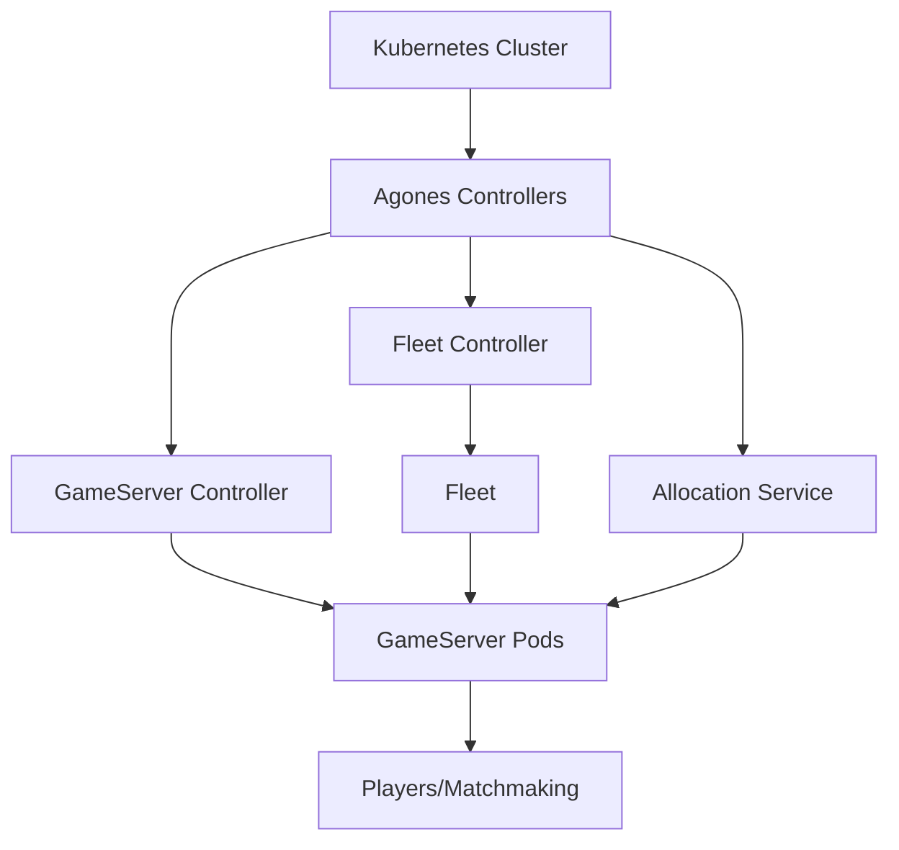
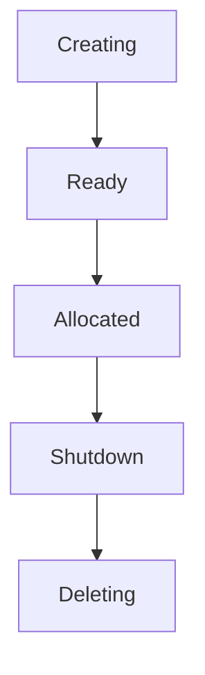
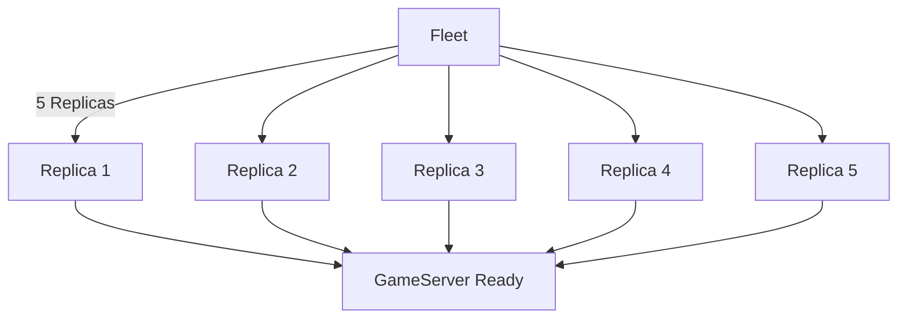
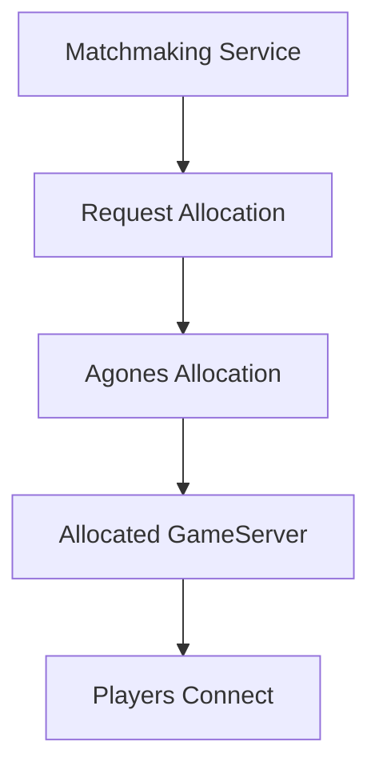
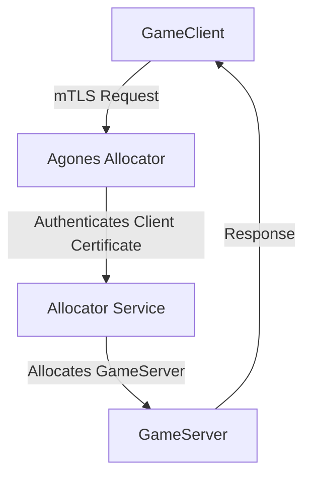
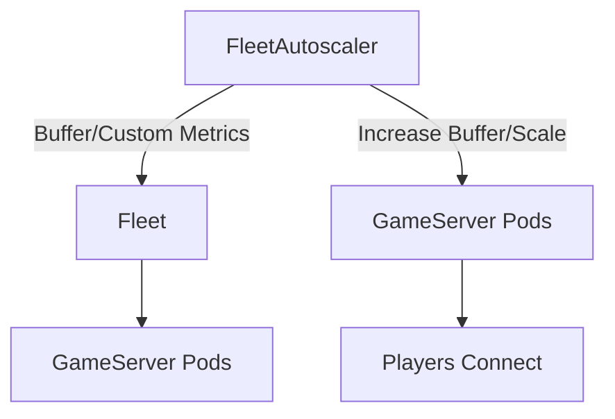

# Agones Overview

Agones is an open-source, Kubernetes-based platform for hosting, scaling, and managing multiplayer game servers. It automates game server creation, scaling, allocation, and management.

## Prerequisites

- **Kubernetes Cluster**: A working Kubernetes cluster with `kubectl` configured.
- **Agones Installed**: Follow the [Agones installation guide](https://agones.dev/site/docs/installation/install-agones/) to set up Agones on your Kubernetes cluster.

## Core Concepts

- **GameServer**: Represents a single instance of your game server.
- **Fleet**: A collection of identical game servers that scale dynamically based on demand.
- **Allocation**: Requests to allocate a game server for a player or matchmaker.
- **Scaling**: Adjusts the number of game servers in a fleet based on demand.

## 1. Agones Architecture Overview


```mermaid
graph TD;
    A[Kubernetes Cluster] --> B[Agones Controllers];
    B --> C[GameServer Controller];
    B --> D[Fleet Controller];
    B --> E[Allocation Service];
    C --> F[GameServer Pods];
    D --> G[Fleet];
    G --> F;
    E --> F;
    F --> H[Players/Matchmaking];
```

- **GameServer Controller**: Manages the lifecycle of `GameServer` instances.
- **Fleet Controller**: Manages collections of game servers.
- **Allocation Service**: Allocates game servers for players.

## 2. GameServer Lifecycle


```mermaid
graph TD;
    A[Creating] --> B[Ready];
    B --> C[Allocated];
    C --> D[Shutdown];
    D --> E[Deleting];
```

- **Creating**: GameServer pod is being created.
- **Ready**: Server is ready to accept players.
- **Allocated**: Server is allocated for a game session.
- **Shutdown/Deleting**: The server is shut down and removed.

## 3. Fleet Scaling


```mermaid
graph TD;
    A[Fleet] -->|5 Replicas| B[Replica 1];
    A --> C[Replica 2];
    A --> D[Replica 3];
    A --> E[Replica 4];
    A --> F[Replica 5];
    B --> G[GameServer Ready];
    C --> G;
    D --> G;
    E --> G;
    F --> G;
```

- **Fleet**: Manages multiple `GameServer` instances.
- **Scaling**: Adjusts the number of replicas based on demand.

## 4. GameServer Allocation Process


```mermaid
graph TD;
    A[Matchmaking Service] --> B[Request Allocation];
    B --> C[Agones Allocation];
    C --> D[Allocated GameServer];
    D --> E[Players Connect];
```

- **Request Allocation**: Matchmaking service requests a game server.
- **Agones Allocation**: Finds an available game server.
- **Allocated GameServer**: Players connect to the allocated server.

## 5. UDP Port Allocation in Agones

When deploying `GameServer` instances or creating a `Fleet`, Agones allows you to specify ports that the game server will use. Agones dynamically assigns port numbers based on the configuration defined in the manifest.

### How Port Allocation Works

- **Port Ranges**: Agones can allocate ports dynamically within a range using `portPolicy`.
- **Dynamic vs. Static Ports**: 
  - **Dynamic Ports**: Agones assigns available ports automatically within the specified range.
  - **Static Ports**: Allows for fixed port assignment.

### Example GameServer Manifest

```yaml
apiVersion: "agones.dev/v1"
kind: GameServer
metadata:
  name: example-gameserver
spec:
  ports:
    - name: game-port
      portPolicy: Dynamic
      containerPort: 7654
      protocol: UDP
      minPort: 7000
      maxPort: 8000
  container:
    image: gcr.io/agones-images/udp-server:0.21
```

## 9. Multi-Cluster Allocation in Agones

Multi-cluster allocation in Agones allows game servers to be allocated across multiple Kubernetes clusters, which is useful for ensuring high availability, geographic distribution, and efficient resource usage.

### Key Concepts

- **Global Agones Allocator**: A global service that handles allocation requests across different clusters.
- **Remote Allocators**: Each Kubernetes cluster runs its own Agones allocator service, which the global allocator communicates with.
- **Cross-Cluster Traffic Management**: Managed using networking solutions like Istio, enabling secure and efficient communication between clusters.
- **Failover and Redundancy**: If a game server cannot be allocated in one cluster, the global allocator can try other clusters, ensuring players are always connected to an available server.

### How Multi-Cluster Allocation Works

1. **Player/Matchmaker Request**: A player or matchmaker sends an allocation request to the global Agones allocator.
2. **Global Allocator Routing**: The global allocator uses labels, selectors, or other criteria to determine which cluster is best suited for the request.
3. **Remote Cluster Communication**: The global allocator communicates with the remote allocator in the selected Kubernetes cluster.
4. **Local Allocation**: The remote allocator in the chosen cluster finds an available game server and allocates it.
5. **Response to Player**: The global allocator returns the connection details of the allocated game server back to the player or matchmaker.

### Example Multi-Cluster Allocation Manifest

```yaml
apiVersion: "agones.dev/v1"
kind: GameServerAllocation
metadata:
  name: multi-cluster-allocation
spec:
  required:
    matchLabels:
      gameMode: battle-royale
  scheduling:
    strategy: MultiCluster
  clusters:
    - name: cluster-europe
      address: europe-allocator.example.com
    - name: cluster-us
      address: us-allocator.example.com
```

### mTLS (Mutual TLS) in Agones

Mutual TLS (mTLS) is a security protocol where both the client and server authenticate each other using certificates. This is especially important for ensuring secure communication between different services in a Kubernetes cluster, such as between the **game clients** and **Agones controllers**, or between **Agones controllers** and **game servers**.

### Why Agones Needs mTLS

1. **Secure Communication**: Game servers often communicate with external services or other clusters (e.g., allocation requests between clusters or regions). mTLS ensures that only authenticated and trusted services can communicate with each other, preventing man-in-the-middle attacks and unauthorized access.
  
2. **Authentication**: mTLS ensures that both the client (game server) and the server (Agones controller) are authenticated before establishing communication.

3. **Encryption**: All communication is encrypted, adding an extra layer of protection for sensitive data, such as player statistics or game session information.

### Example Setup for mTLS in Agones

1. **Generate Certificates**: Create the **root certificate**, **server certificate**, and **client certificate** using tools like OpenSSL.

2. **Set Up the Agones Allocator**: Configure the Agones allocator service to use the **server certificates**.

   Example allocator deployment:

   ```yaml
   apiVersion: apps/v1
   kind: Deployment
   metadata:
     name: agones-allocator
     namespace: agones-system
   spec:
     template:
       spec:
         containers:
           - name: agones-allocator
             image: gcr.io/agones-images/allocator:1.14.0
             ports:
               - containerPort: 8443  # mTLS port
             volumeMounts:
               - name: tls-certs
                 mountPath: /etc/tls
         volumes:
           - name: tls-certs
             secret:
               secretName: agones-allocator-tls
   ```

3. **Client-Side Allocation Request Using mTLS**: When allocating a fleet or game server, the client sends the request along with the **client certificate** for mutual authentication.

   Example allocation request using mTLS with `curl`:

   ```bash
   curl -v --cert client.crt --key client.key --cacert ca.crt      -H "Content-Type: application/json"      --data '{
       "namespace": "default",
       "required": {
         "matchLabels": {
           "agones.dev/fleet": "example-fleet"
         }
       }
     }' https://agones-allocator:8443/v1/gameserverallocation
   ```

### Diagram: mTLS in Agones Allocation


```mermaid
graph TD;
    A[GameClient] -->|mTLS Request| B[Agones Allocator];
    B -->|Authenticates Client Certificate| C[Allocator Service];
    C -->|Allocates GameServer| D[GameServer];
    D -->|Response| A;
```


## 10. Fleet and GameServer Autoscaling

Autoscaling in Agones allows fleets and game servers to automatically scale up and down based on game server demand or predefined metrics. This is especially useful for handling dynamic workloads, optimizing resource use, and ensuring high availability for players.

### FleetAutoscaler

The **FleetAutoscaler** resource allows you to define how a fleet of game servers should be automatically scaled based on certain conditions.

### Example: FleetAutoscaler Manifest

```yaml
apiVersion: "agones.dev/v1"
kind: FleetAutoscaler
metadata:
  name: example-fleet-autoscaler
spec:
  fleetName: example-fleet
  policy:
    type: Buffer
    buffer:
      # Ensure there are always 2 extra GameServers ready to handle new players.
      bufferSize: 2
      minReplicas: 1
      maxReplicas: 10
```

### GameServer Autoscaling with Custom Metrics

You can also autoscale based on **custom metrics** using a webhook or external metrics server. This allows scaling based on metrics such as CPU usage, memory, or even game-specific metrics like the number of connected players.

### Example: FleetAutoscaler with Custom Metrics

```yaml
apiVersion: "agones.dev/v1"
kind: FleetAutoscaler
metadata:
  name: custom-metrics-autoscaler
spec:
  fleetName: example-fleet
  policy:
    type: Webhook
    webhook:
      service:
        name: custom-metrics-service
        namespace: custom-namespace
        path: /scale
      timeoutSeconds: 30
  scale:
    minReplicas: 1
    maxReplicas: 50
```

### Diagram for FleetAutoscaler


```mermaid
graph TD;
    A[FleetAutoscaler] -->|Buffer/Custom Metrics| B[Fleet];
    B --> C[GameServer Pods];
    A -->|Increase Buffer/Scale| D[GameServer Pods];
    D --> E[Players Connect];
```

