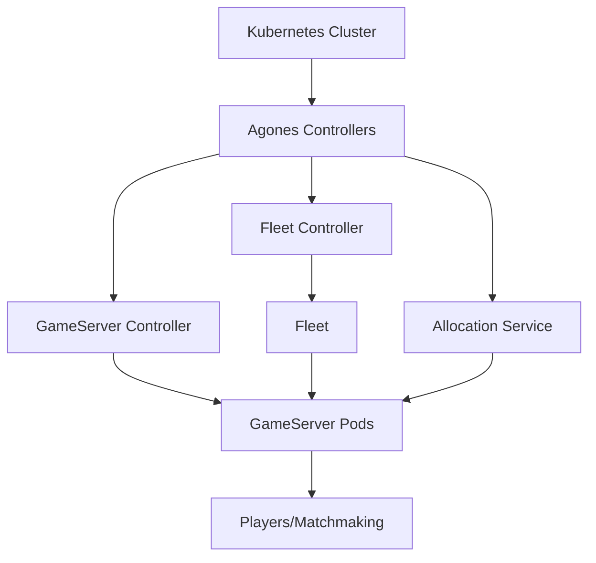
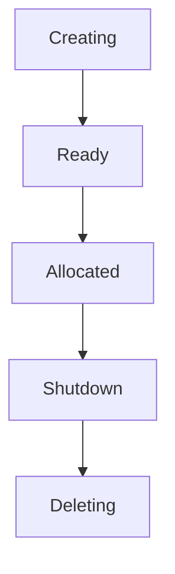
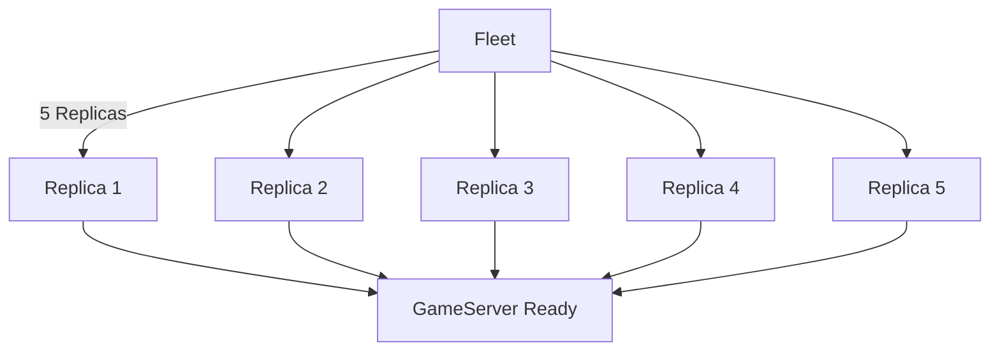
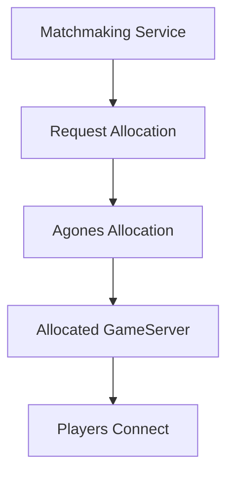
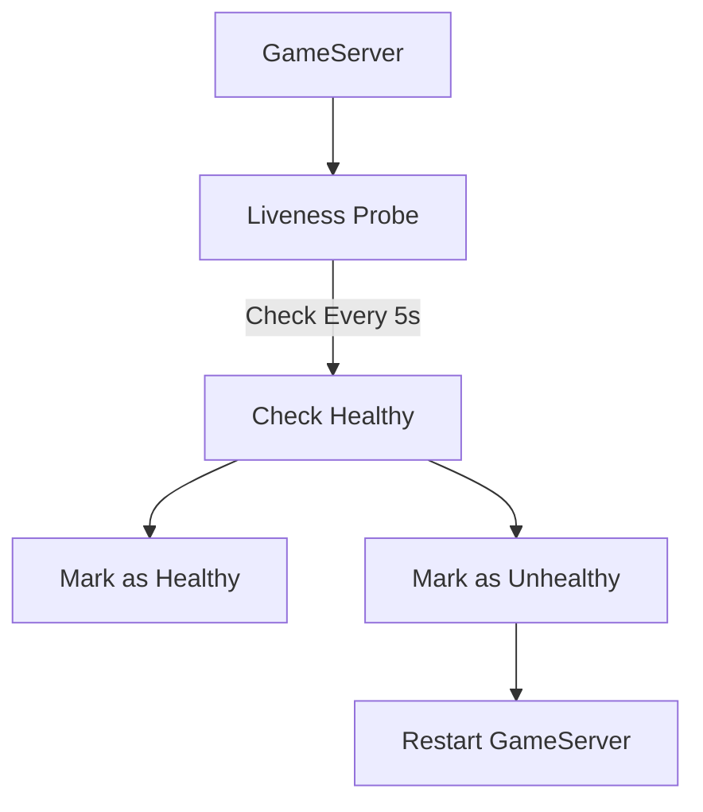
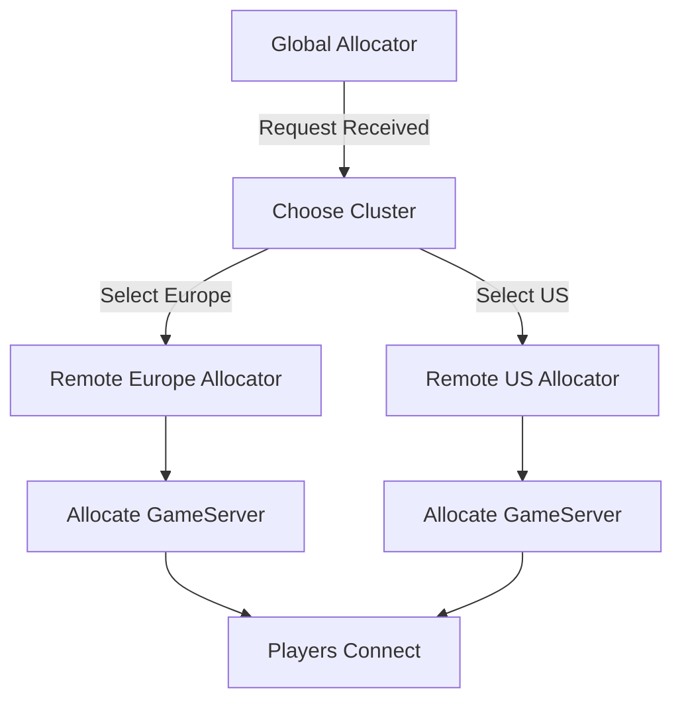
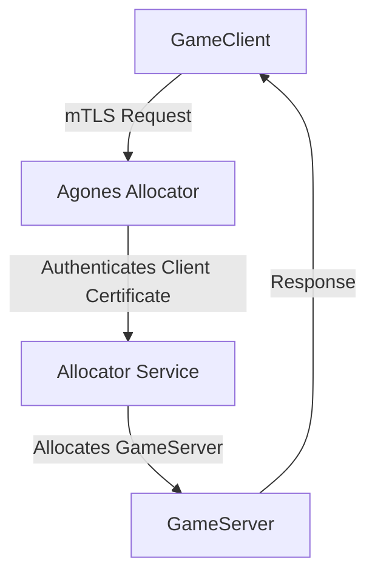
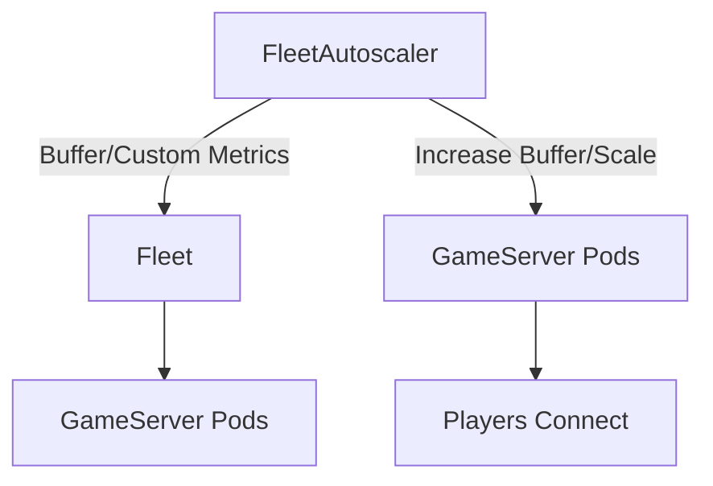

# Agones Overview

Agones is an open-source platform based on Kubernetes that hosts, scales, and manages multiplayer game servers. It automates the lifecycle of game servers, scaling, and allocation based on real-time demand.

## Prerequisites
- **Kubernetes Cluster**: A running Kubernetes cluster configured with `kubectl`.
- **Agones Installed**: Follow [Agones installation guide](https://agones.dev/site/docs/installation/install-agones/) to install Agones.

## Core Concepts
- **GameServer**: An instance of your game server.
- **Fleet**: A collection of game servers that scales dynamically based on demand.
- **Allocation**: Requests to allocate game servers for players.
- **Scaling**: Scales the game servers based on fleet demand.

---

## 1. Agones Architecture Overview

- **GameServer Controller**: Manages the lifecycle of GameServer instances.
- **Fleet Controller**: Manages fleets of game servers.
- **Allocation Service**: Allocates game servers based on demand.

```mermaid
graph TD;
    A[Kubernetes Cluster] --> B[Agones Controllers];
    B --> C[GameServer Controller];
    B --> D[Fleet Controller];
    B --> E[Allocation Service];
    C --> F[GameServer Pods];
    D --> G[Fleet];
    G --> F;
    E --> F;
    F --> H[Players/Matchmaking];
```

---

## 2. GameServer Lifecycle
The GameServer lifecycle ensures servers are managed effectively, going through creation, readiness, allocation, and shutdown.

```mermaid
graph TD;
    A[Creating] --> B[Ready];
    B --> C[Allocated];
    C --> D[Shutdown];
    D --> E[Deleting];
```

---

## 3. Fleet Scaling
Agones allows fleets to maintain multiple GameServer instances and adjusts them dynamically based on player demand.

```mermaid
graph TD;
    A[Fleet] -->|5 Replicas| B[Replica 1];
    A --> C[Replica 2];
    A --> D[Replica 3];
    A --> E[Replica 4];
    A --> F[Replica 5];
    B --> G[GameServer Ready];
    C --> G;
    D --> G;
    E --> G;
    F --> G;
```

---

## 4. GameServer Allocation Process
This process ensures players are connected to an available and healthy GameServer.

```mermaid
graph TD;
    A[Matchmaking Service] --> B[Request Allocation];
    B --> C[Agones Allocation];
    C --> D[Allocated GameServer];
    D --> E[Players Connect];
```

---

## 5. UDP Port Allocation in Agones
Agones allows the allocation of UDP ports dynamically or statically based on the `GameServer` manifest.

---

## 6. Agones SDK
The Agones SDK allows game servers to interact with Agones and manage their lifecycle, such as being marked as "Ready", "Allocated", or "Shutdown".

---

## 7. Health Checks
Agones uses Kubernetes’ liveness probe to ensure that only healthy game servers are allocated to players.

```mermaid
graph TD;
    A[GameServer] --> B[Liveness Probe];
    B -->|Check Every 5s| C[Check Healthy];
    C --> D[Mark as Healthy];
    C --> E[Mark as Unhealthy];
    E --> F[Restart GameServer];
```

---

## 8. Multi-Cluster Allocation
Agones supports allocating game servers across multiple clusters to ensure high availability and geographic distribution of resources.

```mermaid
graph TD;
    A[Global Allocator] -->|Request Received| B[Choose Cluster];
    B -->|Select Europe| C[Remote Europe Allocator];
    B -->|Select US| D[Remote US Allocator];
    C --> E[Allocate GameServer];
    D --> F[Allocate GameServer];
    E --> G[Players Connect];
    F --> G;
```

---

## 9. mTLS in Agones Allocation
Agones supports mTLS (mutual TLS) to secure communication between game clients and the Agones allocator, ensuring that only authenticated services interact with one another.

```mermaid
graph TD;
    A[GameClient] -->|mTLS Request| B[Agones Allocator];
    B -->|Authenticates Client Certificate| C[Allocator Service];
    C -->|Allocates GameServer| D[GameServer];
    D -->|Response| A;
```

---

## 10. Fleet and GameServer Autoscaling
Autoscaling ensures that game server fleets dynamically adjust their size based on buffer or custom metrics.

```mermaid
graph TD;
    A[FleetAutoscaler] -->|Buffer/Custom Metrics| B[Fleet];
    B --> C[GameServer Pods];
    A -->|Increase Buffer/Scale| D[GameServer Pods];
    D --> E[Players Connect];
```

---

## Agones Deployment Components

- **agones-allocator**: Handles allocating game servers for players.
- **agones-controller**: Manages the lifecycle of game servers and fleets.
- **agones-extensions**: Provides additional services extending core functionality.
- **agones-ping**: A simple ping service for testing game server health.
