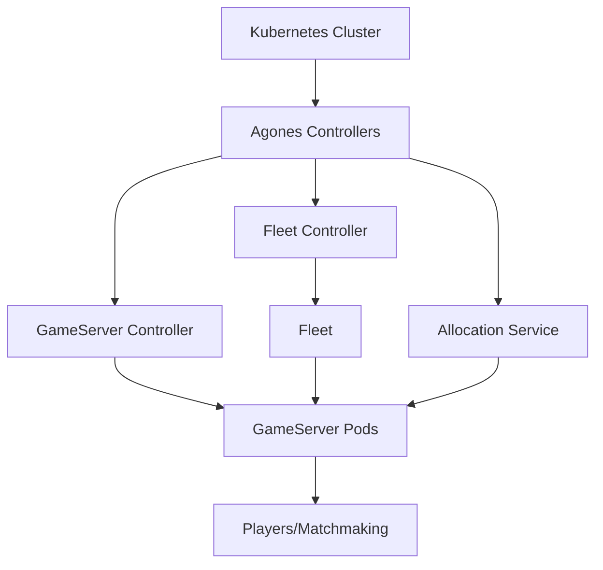
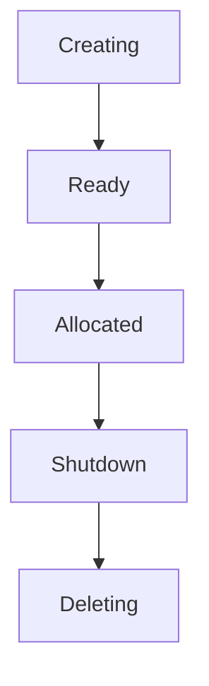
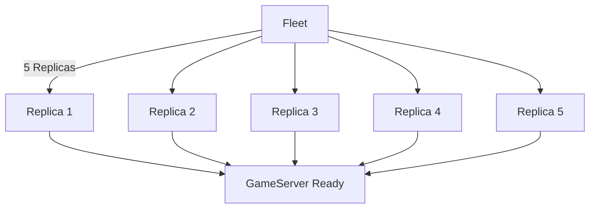
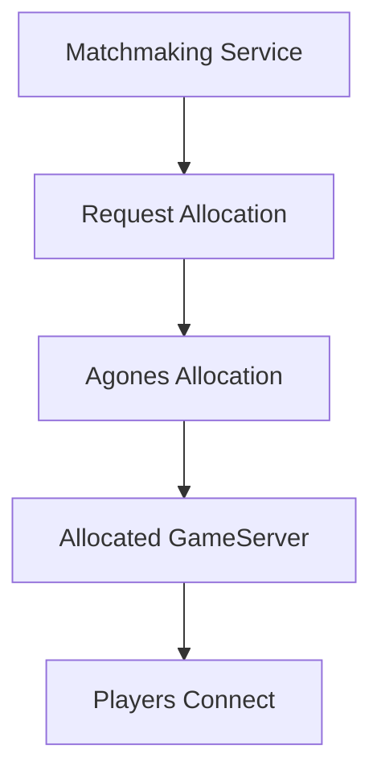
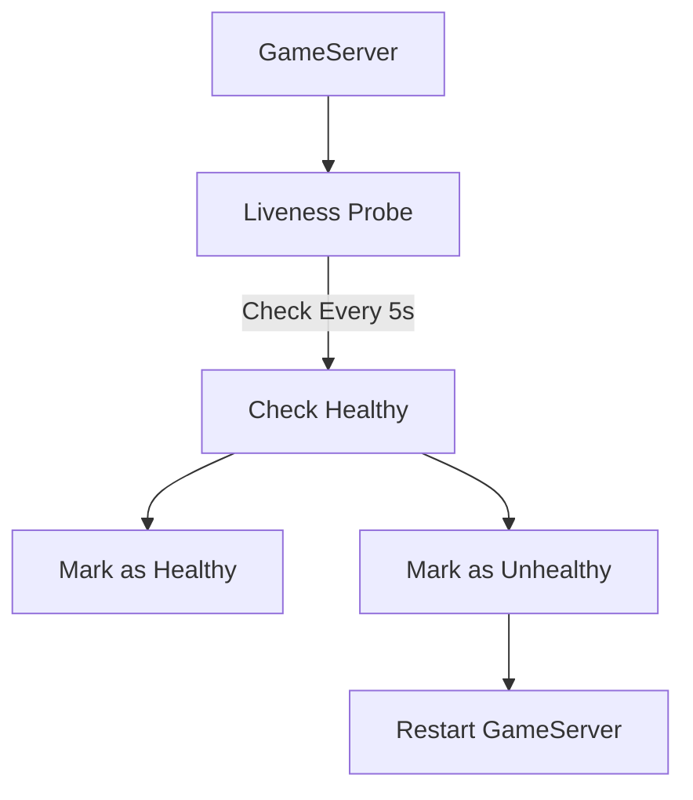
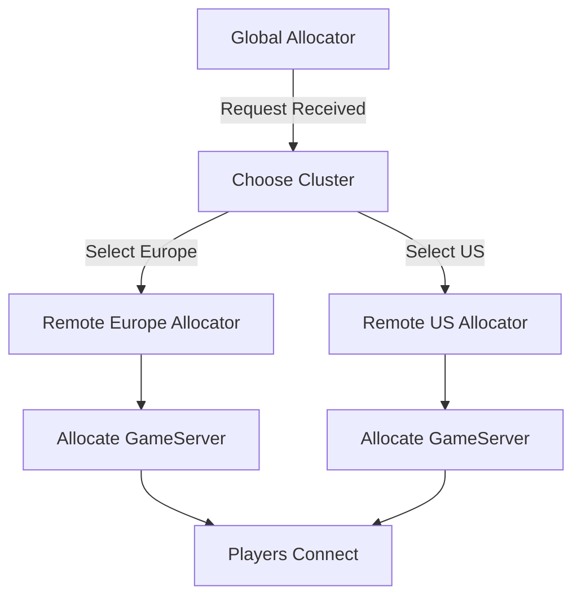
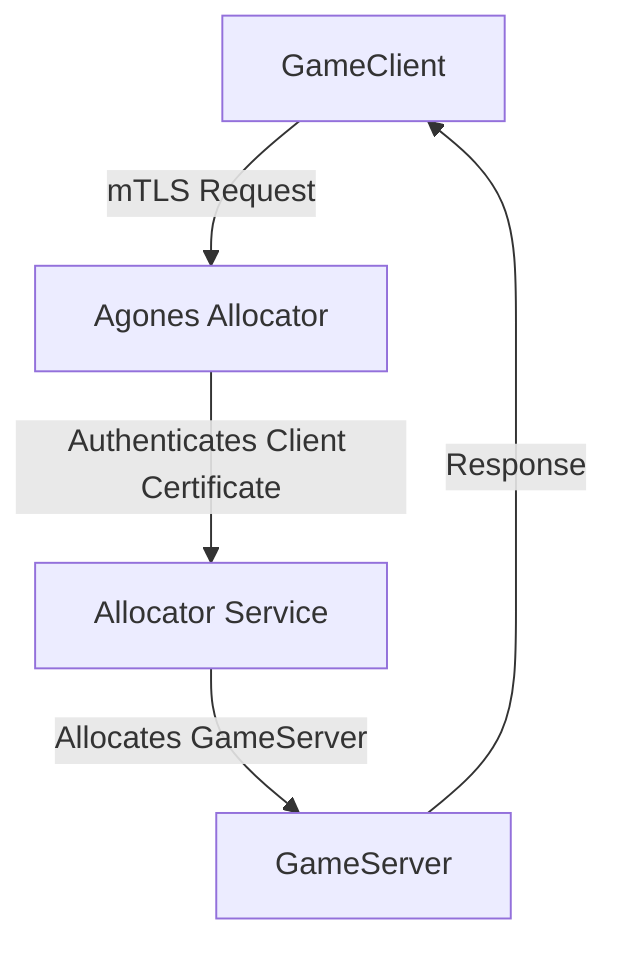
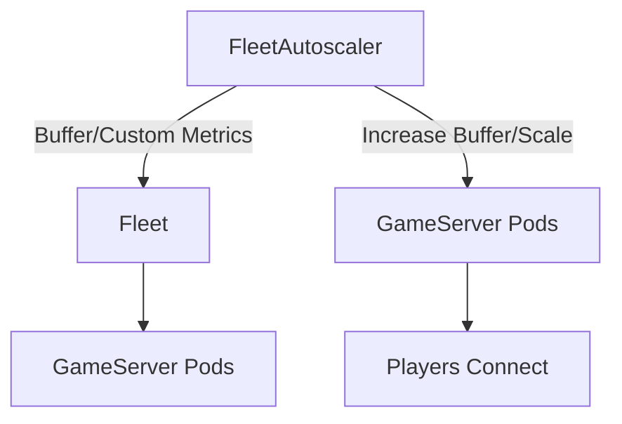

# Agones Overview

Agones is an open-source platform based on Kubernetes that hosts, scales, and manages multiplayer game servers. It automates the lifecycle of game servers, scaling, and allocation based on real-time demand.

## Prerequisites
- **Kubernetes Cluster**: A running Kubernetes cluster configured with `kubectl`.
- **Agones Installed**: Follow [Agones installation guide](https://agones.dev/site/docs/installation/install-agones/) to install Agones.

## Core Concepts
- **GameServer**: An instance of your game server.
- **Fleet**: A collection of game servers that scales dynamically based on demand.
- **Allocation**: Requests to allocate game servers for players.
- **Scaling**: Scales the game servers based on fleet demand.

---

## 1. Agones Architecture Overview

- **GameServer Controller**: Manages the lifecycle of GameServer instances.
- **Fleet Controller**: Manages fleets of game servers.
- **Allocation Service**: Allocates game servers based on demand.

```mermaid
graph TD;
    A[Kubernetes Cluster] --> B[Agones Controllers];
    B --> C[GameServer Controller];
    B --> D[Fleet Controller];
    B --> E[Allocation Service];
    C --> F[GameServer Pods];
    D --> G[Fleet];
    G --> F;
    E --> F;
    F --> H[Players/Matchmaking];
```

---

## 2. GameServer Lifecycle
The GameServer lifecycle ensures servers are managed effectively, going through creation, readiness, allocation, and shutdown.

```mermaid
graph TD;
    A[Creating] --> B[Ready];
    B --> C[Allocated];
    C --> D[Shutdown];
    D --> E[Deleting];
```

---

## 3. Fleet Scaling
Agones allows fleets to maintain multiple GameServer instances and adjusts them dynamically based on player demand.

```mermaid
graph TD;
    A[Fleet] -->|5 Replicas| B[Replica 1];
    A --> C[Replica 2];
    A --> D[Replica 3];
    A --> E[Replica 4];
    A --> F[Replica 5];
    B --> G[GameServer Ready];
    C --> G;
    D --> G;
    E --> G;
    F --> G;
```

---

## 4. GameServer Allocation Process
This process ensures players are connected to an available and healthy GameServer.

```mermaid
graph TD;
    A[Matchmaking Service] --> B[Request Allocation];
    B --> C[Agones Allocation];
    C --> D[Allocated GameServer];
    D --> E[Players Connect];
```

---

## 5. UDP Port Allocation in Agones
Agones allows the allocation of UDP ports dynamically or statically based on the `GameServer` manifest.

---

## 6. Agones SDK
The Agones SDK allows game servers to interact with Agones and manage their lifecycle, such as being marked as "Ready", "Allocated", or "Shutdown".

---

## 7. Health Checks
Agones uses Kubernetes’ liveness probe to ensure that only healthy game servers are allocated to players.

```mermaid
graph TD;
    A[GameServer] --> B[Liveness Probe];
    B -->|Check Every 5s| C[Check Healthy];
    C --> D[Mark as Healthy];
    C --> E[Mark as Unhealthy];
    E --> F[Restart GameServer];
```

---

## 8. Multi-Cluster Allocation
Agones supports allocating game servers across multiple clusters to ensure high availability and geographic distribution of resources.

```mermaid
graph TD;
    A[Global Allocator] -->|Request Received| B[Choose Cluster];
    B -->|Select Europe| C[Remote Europe Allocator];
    B -->|Select US| D[Remote US Allocator];
    C --> E[Allocate GameServer];
    D --> F[Allocate GameServer];
    E --> G[Players Connect];
    F --> G;
```

---

## 9. mTLS in Agones Allocation
Agones supports mTLS (mutual TLS) to secure communication between game clients and the Agones allocator, ensuring that only authenticated services interact with one another.

```mermaid
graph TD;
    A[GameClient] -->|mTLS Request| B[Agones Allocator];
    B -->|Authenticates Client Certificate| C[Allocator Service];
    C -->|Allocates GameServer| D[GameServer];
    D -->|Response| A;
```

---

## 10. Fleet and GameServer Autoscaling
Autoscaling ensures that game server fleets dynamically adjust their size based on buffer or custom metrics.

```mermaid
graph TD;
    A[FleetAutoscaler] -->|Buffer/Custom Metrics| B[Fleet];
    B --> C[GameServer Pods];
    A -->|Increase Buffer/Scale| D[GameServer Pods];
    D --> E[Players Connect];
```

---

## Agones Deployment Components

- **agones-allocator**: Handles allocating game servers for players.
- **agones-controller**: Manages the lifecycle of game servers and fleets.
- **agones-extensions**: Provides additional services extending core functionality.
- **agones-ping**: A simple ping service for testing game server health.

## Agones Deployment Components (Extended)

### 1. **agones-allocator**

- **Function**: 
  The `agones-allocator` component is responsible for allocating game servers to players or matchmaking services. When a request is made to allocate a game server, the allocator selects an available `GameServer` from the fleet and marks it as "Allocated" for the requested session.
  
- **How It Works**:
  It receives allocation requests via the Agones API and uses the allocation policies and scheduling strategy to find a suitable game server instance that meets the requirements of the allocation request (such as game mode, location, etc.). The allocator interacts closely with the **GameServer Controller** and **Fleet Controller** to perform these tasks. The allocator ensures that only healthy, available game servers are allocated to players, contributing to a smooth gaming experience.

### 2. **agones-controller**

- **Function**: 
  The `agones-controller` is the core component of the Agones deployment and is responsible for managing the lifecycle of custom Agones resources like `GameServer`, `Fleet`, and `GameServerAllocation`. This controller is what makes Agones capable of managing game servers using Kubernetes as the orchestrator.

- **How It Works**: 
  It continuously watches Kubernetes custom resources (CRDs) such as `GameServer` and `Fleet`, and adjusts the game server instances accordingly. For example, when a new `Fleet` is created, the controller ensures the appropriate number of `GameServer` instances are spawned. If a game server is marked as unhealthy, the controller will remove it and create a new instance in its place. The `agones-controller` also coordinates scaling actions, ensuring that fleets can scale up and down based on demand.

### 3. **agones-extensions**

- **Function**: 
  The `agones-extensions` component provides additional functionalities that extend the core behavior of Agones. This component can include custom health checks, logging, telemetry services, or integrations with external monitoring tools.

- **How It Works**:
  Extensions might involve custom Kubernetes operators or add-ons that work with Agones resources. For example, you might have an extension that monitors game server performance and reports it to an external metrics service or a health-check service that extends the built-in liveness probes. These extensions allow developers to add custom behaviors or augment the default game server lifecycle without changing the core Agones platform.

### 4. **agones-ping**

- **Function**: 
  The `agones-ping` is a simple, lightweight service that responds to "ping" requests, acting as an example of a minimal game server. It is often used to demonstrate or test the health and readiness of game server pods in Agones.

- **How It Works**:
  The `agones-ping` service listens for ping requests on a specified port and responds to those requests, which can be used to verify whether the game server is alive and healthy. It's particularly useful for testing fleet autoscaling and deployment as it emulates a game server, allowing the Agones infrastructure to demonstrate scaling, health checks, and game server lifecycle management in real-time.

### 5. **FleetAutoscaler**

- **Function**: 
  The `FleetAutoscaler` is an optional but crucial component in many Agones setups. It allows fleets to automatically scale up or down based on predefined buffer sizes or custom metrics, ensuring that there are always a certain number of available game servers ready to handle player connections.

- **How It Works**:
  The autoscaler monitors the fleet and checks how many game servers are in use versus how many are available. Based on this, it adjusts the number of replicas to maintain a buffer of available servers, so new player requests can be handled immediately. The autoscaler can also work with custom metrics (e.g., CPU usage, memory consumption) to optimize scaling based on game-specific performance metrics.

### Agones Deployment Summary
These components form the backbone of the Agones platform. Together, they ensure that multiplayer game servers are managed efficiently, scaling dynamically to meet the needs of players and matchmakers. The `agones-allocator` allocates servers, the `agones-controller` manages the game server lifecycle, `agones-extensions` provides additional features, and `agones-ping` acts as a health check utility.
